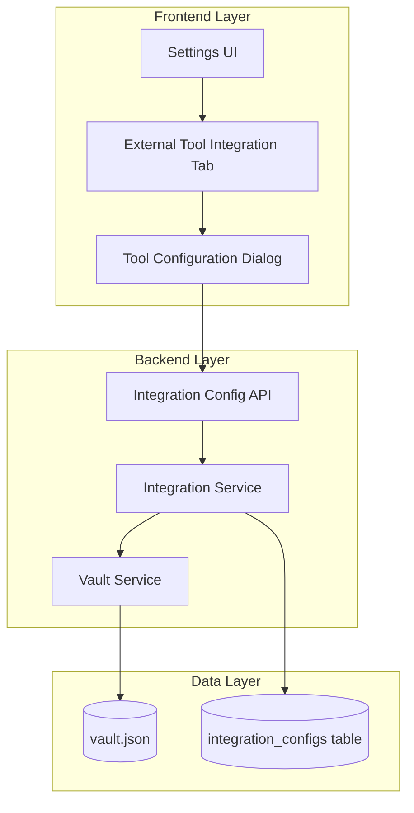

# Design Document: External Tool Integration

## Overview

The External Tool Integration feature provides users with a centralized interface to configure and manage connections to external applications (Jira, Adio, and other third-party tools) through the master settings UI. This design extends the existing settings architecture with a new "External Tool Integration" tab that presents first in the navigation order, offering a dialog-based configuration workflow for tool selection, API key management, and base URL configuration.

### Key Design Decisions

1. **Dialog-Based Configuration**: Use a modal dialog overlay for tool configuration to provide a focused, uninterrupted user experience while entering sensitive credentials
2. **Encryption at Rest**: Leverage the existing VaultService infrastructure to encrypt API keys before persisting to storage
3. **Extensible Tool Registry**: Implement a pluggable tool registry pattern that allows easy addition of new external tools without code changes to the UI components
4. **Tab-First Navigation**: Position the External Tool Integration tab as the first tab in settings to emphasize its importance for system-wide integrations
5. **Secure Credential Handling**: Mask API key inputs in the UI and never log or transmit credentials in plaintext

## Architecture

### System Context

The External Tool Integration feature sits within the existing master settings architecture and interacts with three primary system components:



### Component Interactions

1. **User initiates configuration**: User navigates to Settings UI and selects the External Tool Integration tab
2. **Dialog presentation**: User clicks "Configure Tool" button, triggering modal dialog display
3. **Tool selection**: User selects a tool from the dropdown (e.g., Jira, Adio)
4. **Credential entry**: User enters API key (masked) and base URL
5. **Configuration save**: On save, frontend sends POST request to `/api/v1/integrations` endpoint
6. **Encryption & persistence**: Backend encrypts API key via VaultService and stores configuration in database
7. **Confirmation**: Success response triggers confirmation message and dialog close

### Technology Stack

- **Frontend**: Vanilla JavaScript (consistent with existing app.js patterns)
- **Backend**: FastAPI (Python 3.11+)
- **Database**: PostgreSQL (primary) with SQLAlchemy ORM
- **Encryption**: Fernet symmetric encryption via cryptography library
- **Storage**: Combined approach - metadata in PostgreSQL, encrypted credentials in vault.json


## Components and Interfaces

### Frontend Components

#### 1. External Tool Integration Tab

**Purpose**: Primary navigation tab in master settings for accessing tool integration features

**Location**: `frontend/index.html` - Settings view tab navigation

**Responsibilities**:
- Display as first tab in settings navigation
- Render list of configured tools
- Provide "Configure Tool" button to open configuration dialog
- Show tool integration status (connected/disconnected)

**HTML Structure**:
```html
<button class="tab-btn" onclick="switchSettingsTab('external-tools')" 
        style="[existing tab button styles]">
  External Tool Integration
</button>

<div id="settings-tab-external-tools" class="settings-tab-content">
  <p class="page-description">
    Configure integrations with external applications such as Jira and Adio.
  </p>
  
  <button class="btn-primary" onclick="openToolConfigDialog()">
    Configure Tool
  </button>
  
  <div id="configured-tools-list" class="tools-grid">
    <!-- Dynamically populated with configured tools -->
  </div>
</div>
```

**State Management**:
- `configuredTools`: Array of tool configurations loaded from backend
- `selectedTool`: Currently selected tool for editing (null for new configuration)


#### 2. Tool Configuration Dialog

**Purpose**: Modal dialog for entering and editing tool integration configurations

**Location**: `frontend/index.html` - Modal overlay section

**Responsibilities**:
- Display tool selector dropdown with available tools
- Provide masked input field for API key
- Validate base URL format
- Enable/disable save button based on validation state
- Handle save and cancel operations

**HTML Structure**:
```html
<div id="tool-config-modal" class="modal">
  <div class="modal-content">
    <div class="modal-header">
      <h2>Configure External Tool</h2>
      <button class="modal-close" onclick="closeToolConfigDialog()">&times;</button>
    </div>
    
    <div class="modal-body">
      <div class="form-group">
        <label for="tool-selector">External Tool</label>
        <select id="tool-selector" class="form-control">
          <option value="">-- Select a tool --</option>
          <option value="jira">Jira</option>
          <option value="adio">Adio</option>
          <!-- Additional tools added dynamically -->
        </select>
      </div>
      
      <div class="form-group">
        <label for="tool-api-key">API Key</label>
        <input type="password" id="tool-api-key" class="form-control" 
               placeholder="Enter your API key" />
        <small class="form-text">Your API key will be encrypted and stored securely</small>
      </div>
      
      <div class="form-group">
        <label for="tool-base-url">Base URL</label>
        <input type="url" id="tool-base-url" class="form-control" 
               placeholder="https://your-instance.example.com" />
      </div>
    </div>
    
    <div class="modal-footer">
      <button class="btn-secondary" onclick="closeToolConfigDialog()">Cancel</button>
      <button id="save-tool-config-btn" class="btn-primary" 
              onclick="saveToolConfig()" disabled>Save</button>
    </div>
  </div>
</div>
```


**Validation Rules**:
- Tool selector: Must not be empty
- API key: Must not be empty, accepts alphanumeric and special characters
- Base URL: Must match URL pattern (protocol://domain), must not be empty
- Save button: Enabled only when all fields pass validation

**JavaScript Functions** (`frontend/js/app.js`):
```javascript
openToolConfigDialog() {
  // Reset form fields
  // Show modal with overlay
  // Initialize validation listeners
}

closeToolConfigDialog() {
  // Clear form fields
  // Hide modal
  // Reset validation state
}

validateToolConfig() {
  // Check all fields
  // Enable/disable save button
  // Show/hide error messages
}

async saveToolConfig() {
  // Collect form data
  // POST to /api/v1/integrations
  // Handle response
  // Show success/error message
  // Close dialog on success
}
```

