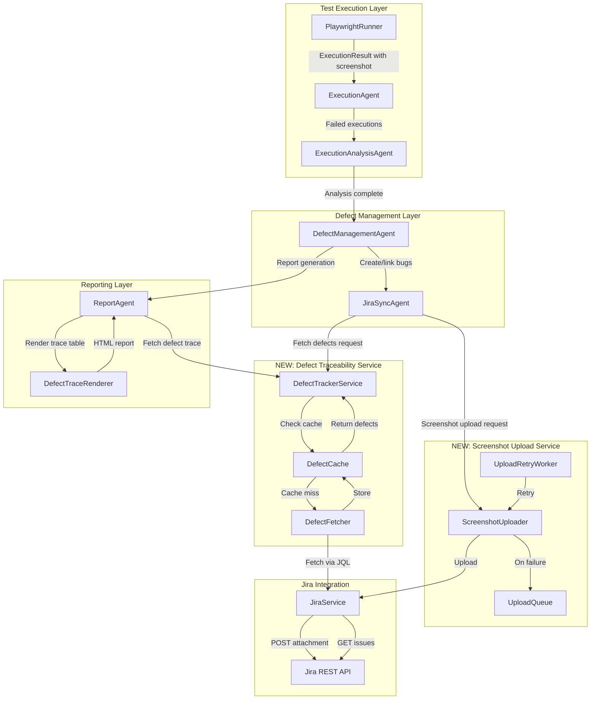

# Design Document: Jira Defect Traceability Enhancement

## Overview

This design enhances the existing Jira integration with automatic screenshot upload functionality and comprehensive defect traceability reporting. The system will capture failed step screenshots, upload them to Jira issues, and display a complete defect trace table in execution reports showing all linked defects with real-time synchronization.

### Key Features

1. **Automatic Screenshot Upload**: Failed test steps trigger immediate screenshot uploads to linked Jira issues
2. **Defect Trace Table**: Execution reports display a comprehensive table of all related defects with S.No, ID, Description, and Status
3. **Real-time Jira Synchronization**: Defect information is fetched and cached for display in reports
4. **Defect Relationship Discovery**: Automatically discovers all defects linked to test cases via Jira relationships
5. **Resilient Error Handling**: Queue-based retry mechanism with exponential backoff for failed uploads

### Goals

- Provide immediate visual context for defects by automatically attaching screenshots
- Enable quick defect review through comprehensive trace tables in reports
- Reduce manual Jira navigation by providing clickable defect links and cached information
- Ensure system resilience through queuing and retry mechanisms
- Optimize performance through batching and caching strategies

## Architecture

### Component Overview



### Architectural Principles

1. **Separation of Concerns**: Screenshot uploading, defect tracking, and reporting are independent services
2. **Asynchronous Processing**: Screenshot uploads happen asynchronously to avoid blocking test execution
3. **Resilience**: Queue-based retry mechanism ensures uploads complete even if Jira is temporarily unavailable
4. **Performance**: Caching and batching reduce API calls and improve response times
5. **Extensibility**: Services use dependency injection for testing and future enhancement

### Data Flow

#### Screenshot Upload Flow

1. **Capture**: PlaywrightRunner captures screenshot on step failure
2. **Attach**: ExecutionAgent attaches screenshot path to ExecutionResult
3. **Trigger**: DefectManagementAgent or JiraSyncAgent detects failed step with Jira link
4. **Upload**: ScreenshotUploader sanitizes filename and uploads via JiraService
5. **Comment**: ScreenshotUploader adds contextual comment with step details
6. **Retry**: On failure, upload is queued for retry with exponential backoff

#### Defect Trace Flow

1. **Request**: ReportAgent requests defect trace for test case
2. **Cache Check**: DefectTrackerService checks DefectCache for cached data
3. **Fetch**: On cache miss, DefectFetcher queries Jira via JQL for related defects
4. **Batch**: Multiple test cases batch defect fetches (50 issues per API call)
5. **Cache**: DefectFetcher stores results in DefectCache with 5-minute TTL
6. **Render**: DefectTraceRenderer formats defects into HTML table with color coding
7. **Display**: Rendered table embedded in execution report

## Components and Interfaces

### 1. ScreenshotUploader

**Purpose**: Manages screenshot upload to Jira with filename sanitization and contextual comments

**Location**: `backend/services/screenshot_uploader.py`

**Key Methods**:

```python
class ScreenshotUploader:
    def __init__(self, jira_service: JiraService, upload_queue: UploadQueue):
        """Initialize with Jira service and upload queue dependencies"""
        
    def upload_step_screenshot(
        self,
        jira_issue_key: str,
        screenshot_path: str,
        step_name: str,
        test_case_name: str,
        execution_timestamp: datetime,
        report_url: str | None = None
    ) -> bool:
        """
        Upload screenshot for failed step with contextual metadata.
        
        Args:
            jira_issue_key: Jira issue key (e.g., PROJ-123)
            screenshot_path: Local file path to screenshot
            step_name: Name of failed step
            test_case_name: Name of test case
            execution_timestamp: ISO 8601 timestamp of execution
            report_url: Optional URL back to execution report
            
        Returns:
            True if upload succeeded, False if queued for retry
        """
        
    def _sanitize_filename(self, filename: str) -> str:
        """Remove invalid characters for Jira attachments"""
        
    def _generate_filename(
        self,
        test_case_name: str,
        step_number: int,
        timestamp: datetime
    ) -> str:
        """Generate unique filename: testcase_step_timestamp.png"""
        
    def _add_upload_comment(
        self,
        jira_issue_key: str,
        step_name: str,
        test_case_name: str,
        execution_timestamp: datetime,
        report_url: str | None
    ) -> bool:
        """Add comment with step context and report link"""
```

**Dependencies**:
- `JiraService`: For API communication
- `UploadQueue`: For retry queueing on failure

**Design Decisions**:
- Filename format: `{sanitized_test_case_name}_step{number}_{iso_timestamp}.{ext}`
- Supported formats: PNG, JPEG, WebP (detected from file extension)
- Screenshot compression: Images >2MB compressed before upload
- Uploads happen asynchronously via thread pool executor
- Failed uploads queued immediately without blocking caller

### 2. UploadQueue

**Purpose**: Persistent queue for failed screenshot uploads with retry scheduling

**Location**: `backend/services/upload_queue.py`

**Key Methods**:

```python
class UploadQueueItem:
    """Represents a queued screenshot upload"""
    id: str
    jira_issue_key: str
    screenshot_path: str
    step_name: str
    test_case_name: str
    execution_timestamp: datetime
    report_url: str | None
    retry_count: int
    next_retry_at: datetime
    created_at: datetime

class UploadQueue:
    def __init__(self, storage_path: str = "./.upload_queue"):
        """Initialize queue with file-based persistence"""
        
    def enqueue(self, item: UploadQueueItem) -> None:
        """Add item to queue"""
        
    def dequeue_ready(self) -> list[UploadQueueItem]:
        """Return items ready for retry (next_retry_at <= now)"""
        
    def update_retry(self, item_id: str, retry_count: int) -> None:
        """Update retry count and schedule next retry with exponential backoff"""
        
    def remove(self, item_id: str) -> None:
        """Remove item after successful upload"""
        
    def get_pending_count(self) -> int:
        """Return count of pending uploads"""
```

**Storage**:
- File-based JSON storage for simplicity and persistence across restarts
- Each queue item stored as separate JSON file
- Queue directory: `.upload_queue/` (configurable)

**Retry Strategy**:
- Max retries: 3
- Backoff formula: `delay = base_delay * (2 ^ retry_count)`
- Base delay: 5 seconds
- Retry schedule: 5s, 10s, 20s

### 3. UploadRetryWorker

**Purpose**: Background worker that processes upload queue periodically

**Location**: `backend/services/upload_retry_worker.py`

**Key Methods**:

```python
class UploadRetryWorker:
    def __init__(
        self,
        upload_queue: UploadQueue,
        screenshot_uploader: ScreenshotUploader,
        poll_interval_seconds: int = 10
    ):
        """Initialize worker with dependencies and poll interval"""
        
    def start(self) -> None:
        """Start background thread for queue processing"""
        
    def stop(self) -> None:
        """Stop background thread gracefully"""
        
    def _process_queue(self) -> None:
        """Process ready items from queue (called periodically)"""
```

**Lifecycle**:
- Started when application starts (in `main.py` initialization)
- Runs in daemon thread
- Polls queue every 10 seconds
- Graceful shutdown on application termination

### 4. DefectTrackerService

**Purpose**: Fetches and manages defect information for test cases from Jira

**Location**: `backend/services/defect_tracker_service.py`

**Key Methods**:

```python
class DefectInfo:
    """Defect information for display"""
    defect_id: str  # Jira issue key
    summary: str
    status: str
    status_category: str  # "done", "in_progress", "to_do"
    created_at: datetime
    updated_at: datetime
    url: str

class DefectTrackerService:
    def __init__(
        self,
        jira_service: JiraService,
        defect_cache: DefectCache,
        defect_fetcher: DefectFetcher
    ):
        """Initialize with Jira service, cache, and fetcher"""
        
    def get_defects_for_test_case(
        self,
        test_case_jira_id: str,
        force_refresh: bool = False
    ) -> list[DefectInfo]:
        """
        Fetch all defects related to test case.
        
        Args:
            test_case_jira_id: Jira issue key of test case
            force_refresh: Skip cache and fetch fresh data
            
        Returns:
            List of defects sorted by creation date (newest first)
        """
        
    def get_defects_batch(
        self,
        test_case_jira_ids: list[str],
        force_refresh: bool = False
    ) -> dict[str, list[DefectInfo]]:
        """
        Batch fetch defects for multiple test cases.
        
        Returns:
            Dictionary mapping test case ID to list of defects
        """
```

**Defect Discovery Strategy**:
1. **Issue Links**: Query `issueLink` for "relates to", "is caused by", etc.
2. **Parent-Child**: Query for issues where parent is test case ID
3. **Custom Field**: Query custom field "Test Case ID" if configured
4. **Labels**: Query for label matching test case reference ID

**JQL Query Example**:
```jql
project = "QA" AND (
    issueLink = "PROJ-123" OR
    parent = "PROJ-123" OR
    "Test Case ID" = "PROJ-123" OR
    labels = "test_proj123"
) AND type = "Bug"
ORDER BY created DESC
```

### 5. DefectCache

**Purpose**: In-memory cache for defect information with TTL expiration

**Location**: `backend/services/defect_cache.py`

**Key Methods**:

```python
class CacheEntry:
    """Cache entry with TTL"""
    data: list[DefectInfo]
    cached_at: datetime
    ttl_seconds: int
    
    def is_expired(self) -> bool:
        """Check if entry has exceeded TTL"""

class DefectCache:
    def __init__(self, default_ttl_seconds: int = 300):
        """Initialize cache with 5-minute default TTL"""
        
    def get(self, test_case_jira_id: str) -> list[DefectInfo] | None:
        """Get cached defects if not expired"""
        
    def set(
        self,
        test_case_jira_id: str,
        defects: list[DefectInfo],
        ttl_seconds: int | None = None
    ) -> None:
        """Cache defects with TTL"""
        
    def invalidate(self, test_case_jira_id: str) -> None:
        """Remove entry from cache"""
        
    def clear(self) -> None:
        """Clear entire cache"""
```

**Cache Strategy**:
- Default TTL: 5 minutes (300 seconds)
- Lazy expiration: Entries checked on access
- No background cleanup (entries removed when accessed and expired)
- Thread-safe using locks for concurrent access

### 6. DefectFetcher

**Purpose**: Fetches defects from Jira with batching support

**Location**: `backend/services/defect_fetcher.py`

**Key Methods**:

```python
class DefectFetcher:
    def __init__(self, jira_service: JiraService, batch_size: int = 50):
        """Initialize with Jira service and batch size"""
        
    def fetch_defects(self, test_case_jira_id: str) -> list[DefectInfo]:
        """Fetch defects for single test case"""
        
    def fetch_defects_batch(
        self,
        test_case_jira_ids: list[str]
    ) -> dict[str, list[DefectInfo]]:
        """
        Fetch defects for multiple test cases in batches.
        
        Batches requests to Jira API (50 test cases per call).
        Uses JQL OR clauses to fetch related defects.
        
        Returns:
            Dictionary mapping test case ID to list of defects
        """
        
    def _parse_defect_info(self, jira_issue: dict) -> DefectInfo:
        """Parse Jira API response into DefectInfo"""
```

**Batching Strategy**:
- Batch size: 50 test case IDs per API call
- JQL query combines multiple test case IDs with OR
- API timeout: 10 seconds
- Concurrent batch execution using thread pool (max 3 concurrent batches)

### 7. DefectTraceRenderer

**Purpose**: Renders defect trace table HTML with formatting and interactivity

**Location**: `backend/services/defect_trace_renderer.py`

**Key Methods**:

```python
class DefectTraceRenderer:
    def render_defect_trace_table(
        self,
        defects: list[DefectInfo],
        jira_base_url: str
    ) -> str:
        """
        Render HTML defect trace table.
        
        Args:
            defects: List of defects to display
            jira_base_url: Base URL for Jira issue links
            
        Returns:
            HTML string with formatted table
        """
        
    def _get_status_color(self, status_category: str) -> str:
        """Map status category to color code"""
        
    def _truncate_description(self, text: str, max_length: int = 100) -> str:
        """Truncate long descriptions with ellipsis"""
```

**Table Format**:

```html
<div class="defect-trace-section">
    <h3>
        Jira Defect Trace 
        <button class="toggle-btn">[Expand/Collapse]</button>
    </h3>
    <div class="defect-trace-content" style="display: block;">
        <table class="defect-trace-table">
            <thead>
                <tr>
                    <th>S.No</th>
                    <th>Defect ID</th>
                    <th>Defect Description</th>
                    <th>Status</th>
                </tr>
            </thead>
            <tbody>
                <tr>
                    <td>1</td>
                    <td><a href="{jira_url}" target="_blank">{issue_key}</a></td>
                    <td title="{full_summary}">{truncated_summary}</td>
                    <td><span class="status-badge status-{category}">{status}</span></td>
                </tr>
                <!-- More rows -->
            </tbody>
        </table>
        <!-- Or empty state -->
        <p class="no-defects">No defects linked to this test case</p>
    </div>
</div>
```

**Color Coding**:
- Green (`status-done`): Resolved, Closed, Done
- Yellow (`status-in_progress`): In Progress, In Review
- Red (`status-to_do`): Open, To Do, Backlog

**Interactivity**:
- Expand/collapse toggle button
- Tooltip on hover for truncated descriptions
- Clickable defect IDs opening in new tab

### 8. JiraService Enhancements

**Purpose**: Add compression and batch upload support to existing JiraService

**Location**: `backend/services/jira_service.py` (enhancement)


**New Methods**:

```python
def upload_attachment_with_compression(
    self,
    issue_key: str,
    filename: str,
    content: bytes,
    mime_type: str,
    max_size_mb: float = 2.0
) -> bool:
    """
    Upload attachment with automatic compression if size exceeds threshold.
    
    Args:
        issue_key: Jira issue key
        filename: Attachment filename
        content: File content as bytes
        mime_type: MIME type (image/png, image/jpeg, etc.)
        max_size_mb: Compression threshold in MB
        
    Returns:
        True if upload succeeded
    """
    
def batch_search_issues(
    self,
    jql_queries: list[str],
    max_concurrent: int = 3
) -> dict[str, list[dict]]:
    """
    Execute multiple JQL queries concurrently.
    
    Args:
        jql_queries: List of JQL query strings
        max_concurrent: Max concurrent API requests
        
    Returns:
        Dictionary mapping query index to results
    """
```

**Compression Strategy**:
- Uses Pillow (PIL) for image compression
- Target quality: 85% for JPEG, optimized PNG
- Preserves aspect ratio
- Only compresses images >2MB
- WebP format not compressed (already efficient)

## Data Models

### ExecutionResult Enhancement

**Location**: `backend/models/execution_result.py`

**Enhancement**:

```python
class ExecutionResult:
    # Existing fields...
    screenshot_path: str | None
    
    # NEW: Step-level screenshot tracking
    step_screenshots: list[StepScreenshot] = []

class StepScreenshot:
    """Screenshot captured for a specific test step"""
    step_number: int
    step_name: str
    screenshot_path: str
    captured_at: datetime
    uploaded_to_jira: bool = False
    jira_attachment_id: str | None = None
```

### ExecutionReport Enhancement

**Location**: `backend/models/execution_report.py`

**Enhancement**:

```python
class ExecutionReport:
    # Existing fields...
    
    # NEW: Defect traceability
    defect_trace_tables: dict[UUID, DefectTraceTable] = {}  # test_case_id -> table

class DefectTraceTable:
    """Defect trace information for a test case"""
    test_case_id: UUID
    test_case_jira_id: str
    defects: list[DefectInfo]
    last_synced_at: datetime
    is_stale: bool = False  # True if Jira was unreachable
```

### ExecutionDB Enhancement

**Location**: `backend/database/db_models.py`

**Enhancement**:

```python
class ExecutionDB(Base):
    # Existing columns...
    
    # NEW: Step screenshot tracking
    step_screenshots_json = Column(JSON, nullable=True)  # List of StepScreenshot dicts
```

**Migration**: Add `step_screenshots_json` column via Alembic migration

## Error Handling

### Upload Failures

**Scenarios**:
1. **Network Timeout**: Jira API unreachable
2. **Authentication Failure**: Invalid credentials or expired token
3. **File Not Found**: Screenshot deleted before upload
4. **API Rate Limit**: Jira rate limit exceeded (429)
5. **Invalid File Format**: Unsupported image format

**Handling Strategy**:

```python
try:
    # Attempt upload
    success = jira_service.upload_attachment(...)
    if success:
        return True
except JiraConnectionError:
    # Network issue - queue for retry
    upload_queue.enqueue(item)
    logger.warning(f"Upload queued for retry: {item.id}")
except JiraAuthenticationError:
    # Auth failure - don't retry, log error
    logger.error(f"Upload failed (auth): {item.id}")
    # Alert admin via notification service
except FileNotFoundError:
    # File missing - don't retry
    logger.error(f"Screenshot not found: {screenshot_path}")
except JiraRateLimitError as e:
    # Rate limit - queue with longer delay
    item.next_retry_at = datetime.now() + timedelta(seconds=e.retry_after)
    upload_queue.enqueue(item)
except Exception as e:
    # Unknown error - log and queue
    logger.exception(f"Upload failed unexpectedly: {e}")
    upload_queue.enqueue(item)
```

### Defect Fetch Failures

**Scenarios**:
1. **Jira Unreachable**: Network or service outage
2. **Invalid JQL**: Malformed query
3. **Permission Denied**: User lacks access to defect
4. **Timeout**: Query takes too long

**Handling Strategy**:

```python
try:
    defects = defect_fetcher.fetch_defects(test_case_jira_id)
    defect_cache.set(test_case_jira_id, defects)
    return defects
except JiraConnectionError:
    # Use cached data if available
    cached = defect_cache.get(test_case_jira_id)
    if cached:
        logger.warning(f"Using stale cache for {test_case_jira_id}")
        return cached, is_stale=True
    else:
        # No cache - return empty with error message
        return [], is_stale=True
except JiraQueryError as e:
    logger.error(f"Invalid JQL query: {e}")
    return []
except Exception as e:
    logger.exception(f"Defect fetch failed: {e}")
    # Fallback to cache
    return defect_cache.get(test_case_jira_id) or []
```

### Retry Exhaustion

**Scenario**: Upload fails after 3 retries

**Handling**:
1. Log error with full context
2. Send notification to admin (email/Slack)
