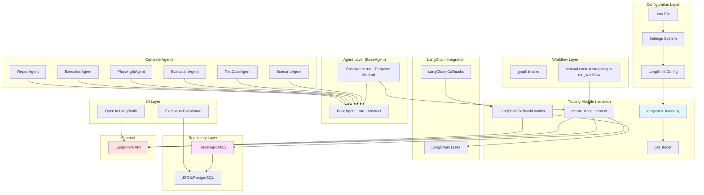
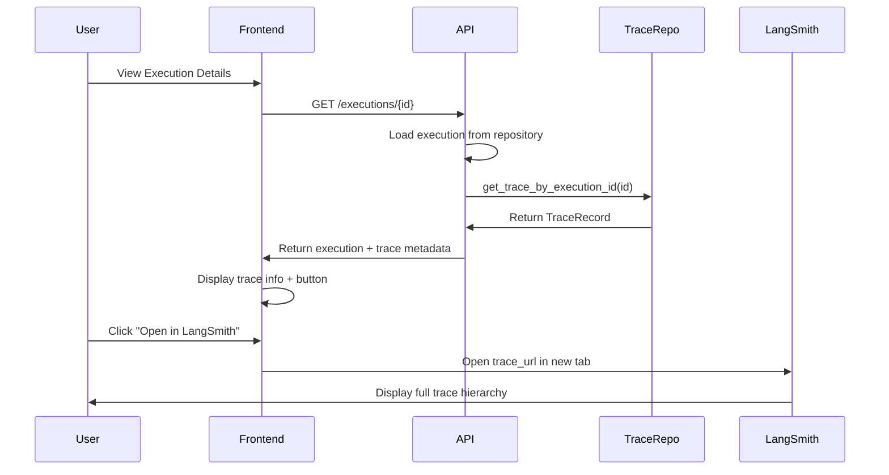

# Technical Design Document: LangSmith Tracing Integration

## Overview

This design specifies the implementation of LangSmith tracing for the Enterprise AI Test Automation Platform. The integration provides observability into LangGraph/LangChain operations by capturing AI agent executions and workflow orchestrations through a Template Method Pattern + Context Manager architecture.

**Design Philosophy:**
- **Template Method Pattern instrumentation**: BaseAgent.run() uses template method pattern to wrap _run() with tracing
- **Manual context wrapping for workflows**: run_workflow() manually wraps graph.invoke() with trace context
- **Decoupled architecture**: WorkflowService knows nothing about LangSmith
- **Graceful degradation**: Workflows continue if tracing fails
- **Zero overhead when disabled**: No performance impact in production when tracing is off
- **LangChain integration**: Automatic LLM metrics capture via LangChain callbacks

**Key Design Principles:**
1. Configuration via environment variables (no code changes for different environments)
2. Isolated tracing module with controlled SDK imports
3. Parent-child trace hierarchy matching workflow-agent relationships
4. Real metrics only from LangChain callbacks (no fabricated data)
5. Transparent to existing workflows and APIs
6. Repository persistence for UI integration
7. Complete execution correlation (execution_id, project_id, requirement_id, scenario_id, testcase_id)

## Architecture

### System Architecture Diagram



### Component Overview

**Tracing Module** (`backend/services/langsmith_tracer.py`):
- **Isolated LangSmith imports**: ALL LangSmith SDK imports stay in this file
- **Exported function**: `get_tracer()` - returns singleton tracer instance
- **Context manager API**: `create_trace_context()` for manual trace wrapping
- **LangChain callback integration**: Automatic LLM metrics capture
- **No-op mode**: All operations become pass-through when tracing is disabled

**Settings Extension** (`backend/config/settings.py`):
- New `LangSmithConfig` model integrated into existing Settings system
- Reads environment variables following platform precedence rules
- Provides type-safe access to configuration

**Instrumentation Points**:
- **BaseAgent.run()**: Template method pattern - run() creates trace context, calls _run()
- **run_workflow()**: Manual trace context wrapping around graph.invoke()
- **LangChain LLMs**: Automatic callback attachment for prompt/completion/token capture
- **No modifications to WorkflowService**: Tracing happens at graph.invoke() level

**Repository Integration** (`backend/repository/trace_repository.py`):
- **Trace metadata persistence**: Store trace_id, execution_id, status, duration, workflow_name
- **Correlation support**: Link traces to projects, requirements, scenarios, test cases
- **UI integration**: Provide trace data for dashboard without calling LangSmith API
- **PostgreSQL-ready**: Schema designed for easy migration from JSON to PostgreSQL

**UI Integration**:
- **Dashboard enhancement**: Display trace status, duration, "Open in LangSmith" button
- **Trace correlation**: Navigate from execution → trace → LangSmith UI
- **Repository-backed**: Traces loaded from local DB, not LangSmith API

## Components and Interfaces

**CRITICAL IMPLEMENTATION FIXES:**

This design incorporates fixes for 10 critical implementation issues:

1. **BaseAgent Template Method Pattern** (Issue #1): Use run() → _run() pattern instead of decorators on abstract methods
2. **Version-Agnostic Callback Integration** (Issue #2): Graceful fallback for LangSmith callback API changes
3. **Direct Trace Context Creation** (Issue #3): Use create_trace_context() instead of nested @traceable decorators
4. **Minimal Repository Storage** (Issue #4): Store ONLY trace_id, correlation IDs, timestamps - no LangSmith data duplication
5. **Dynamic URL Generation** (Issue #5): Compute trace_url on-demand from trace_id + project_name, never persist
6. **No graph.invoke() Decoration** (Issue #6): Manually wrap in run_workflow(), never decorate graph.invoke()
7. **Human Approval Event Spans** (Issue #7): Record testcase_approved/rejected events for workflow visibility
8. **Execution Environment Metadata** (Issue #8): Capture browser, OS, Playwright version for debugging
9. **Conditional Tracing** (Issue #9): Tracing follows actual execution automatically (built into design)
10. **Separate trace_store.json** (Issue #10): backend/database/trace_store.json for clean separation

### 1. LangSmithConfig Model

**Location:** `backend/config/settings.py`

**Interface:**
```python
class LangSmithConfig(BaseModel):
    """LangSmith tracing configuration.
    
    Loaded from environment variables:
    - LANGSMITH_TRACING: Enable/disable tracing (default: false)
    - LANGSMITH_ENDPOINT: API endpoint (default: https://api.smith.langchain.com)
    - LANGSMITH_API_KEY: API authentication key (required if tracing enabled)
    - LANGSMITH_PROJECT: Project name for traces (default: Enterprise-AI-TestAutomation)
    """
    tracing_enabled: bool = False
    endpoint: str = "https://api.smith.langchain.com"
    api_key: str | None = None
    project_name: str = "Enterprise-AI-TestAutomation"
```

**Integration with Settings:**
```python
class Settings(BaseSettings):
    # ... existing fields ...
    langsmith: LangSmithConfig = LangSmithConfig()
    
    @classmethod
    def from_yaml(cls, path: Path = DEFAULT_CONFIG_PATH) -> "Settings":
        # ... existing logic ...
        
        # LangSmith configuration from .env
        raw.setdefault("langsmith", {})
        _override(raw, "langsmith", "tracing_enabled", "LANGSMITH_TRACING", cast=_bool)
        _override(raw, "langsmith", "endpoint", "LANGSMITH_ENDPOINT")
        raw.setdefault("langsmith", {})["api_key"] = _env("LANGSMITH_API_KEY")
        _override(raw, "langsmith", "project_name", "LANGSMITH_PROJECT")
        
        return cls(**raw)
```

### 2. LangSmithTracer Module (Isolated SDK Imports)

**Location:** `backend/services/langsmith_tracer.py`

**CRITICAL RULE**: ALL LangSmith SDK imports MUST stay in this file only. NEVER import LangSmith Client in other modules.

**Exported Interface:**
```python
# Public exports - the ONLY way to use LangSmith in the application
def get_tracer() -> "LangSmithTracer":
    """Get or create singleton tracer instance."""
```

**Internal Implementation (simplified):**
```python
from functools import wraps
from typing import Callable, Any
from contextlib import contextmanager

# ONLY module that imports LangSmith SDK
from langsmith import Client
from langsmith.run_helpers import trace, get_current_run_tree

from backend.config.settings import get_settings


class LangSmithTracer:
    """Centralized LangSmith tracing manager with isolated SDK access."""
    
    def __init__(self):
        """Initialize from settings. Gracefully handles configuration errors."""
        self.settings = get_settings().langsmith
        self.enabled = False
        self.client: Client | None = None
        
        if self.settings.tracing_enabled:
            if not self.settings.api_key:
                logger.warning("LANGSMITH_API_KEY not set, tracing disabled")
                return
            
            try:
                self.client = Client(
                    api_key=self.settings.api_key,
                    api_url=self.settings.endpoint
                )
                self.enabled = True
                logger.info(f"LangSmith tracing enabled (project={self.settings.project_name})")
            except Exception as e:
                logger.error(f"Failed to initialize LangSmith: {e}", exc_info=True)
    
    def attach_langchain_callback(self, llm):
        """Attach LangSmith callback to LangChain LLM for automatic metrics capture.
        
        This captures:
        - Prompts and completions
        - Token usage (input/output/total)
        - Model name and parameters
        - Latency
        - Errors
        
        All captured AUTOMATICALLY by LangChain → LangSmith integration.
        NO manual metric extraction needed.
        """
        if not self.enabled:
            return llm
        
        try:
            from langsmith import LangSmithCallbackHandler
            callback = LangSmithCallbackHandler(project_name=self.settings.project_name)
            llm.callbacks = llm.callbacks or []
            llm.callbacks.append(callback)
        except Exception as e:
            logger.error(f"Failed to attach LangSmith callback: {e}", exc_info=True)
        
        return llm
    
    def extract_metadata(self, state: WorkflowState) -> dict[str, Any]:
        """Extract ALL correlation IDs and metadata from state.
        
        Returns complete metadata for trace enrichment:
        - execution_id
        - project_id
        - requirement_id
        - scenario_id (if processing specific scenario)
        - testcase_id (if processing specific test case)
        - Additional counts and status fields
        """
        metadata = {}
        
        if state.requirement:
            metadata["requirement_id"] = str(state.requirement.id)
            metadata["requirement_title"] = state.requirement.title
            if hasattr(state.requirement, "project_id"):
                metadata["project_id"] = str(state.requirement.project_id)
        
        if state.execution_results:
            # Get execution_id from first result
            metadata["execution_id"] = str(state.execution_results[0].id)
        
        # Scenario correlation
        if state.generated_scenarios:
            metadata["scenario_count"] = len(state.generated_scenarios)
            if state.selected_scenario_ids:
                metadata["approved_scenario_count"] = len(state.selected_scenario_ids)
        
        # Test case correlation
        if state.generated_test_cases:
            metadata["testcase_count"] = len(state.generated_test_cases)
            if state.human_approved_test_case_ids:
                metadata["approved_testcase_count"] = len(state.human_approved_test_case_ids)
        
        # Model configuration
        llm_config = get_settings().llm
        metadata["model_name"] = llm_config.model
        metadata["llm_provider"] = llm_config.provider
        
        return metadata
    
    @contextmanager
    def create_trace_context(self, name: str, metadata: dict):
        """Create a trace context for manual tracing.
        
        Used by template method pattern in BaseAgent.run() and run_workflow().
        
        Yields a trace context object with:
        - trace_id: Current trace ID
        - record_exception(e): Record an exception
        
        Example:
            with tracer.create_trace_context("agent_name", metadata) as ctx:
                result = agent_logic()
                return result
        """
        if not self.enabled:
            # No-op context manager
            yield _NoOpTraceContext()
            return
        
        from langsmith.run_helpers import trace
        
        start_time = datetime.utcnow()
        trace_id = None
        
        try:
            with trace(name=name, metadata=metadata, project_name=self.settings.project_name):
                run_tree = get_current_run_tree()
                trace_id = str(run_tree.id) if run_tree else None
                
                # Yield context with trace_id and exception recording
                ctx = _TraceContext(trace_id=trace_id, run_tree=run_tree)
                yield ctx
                
        except Exception as e:
            # Trace error, but don't propagate
            logger.error(f"Trace context error for '{name}': {e}", exc_info=True)
            yield _NoOpTraceContext()
    
    def persist_trace(
        self,
        trace_id: str,
        workflow_name: str,
        metadata: dict,
        status: str
    ):
        """Persist trace metadata to repository for UI integration."""
        if not self.enabled:
            return
        
        try:
            from backend.repository.trace_repository import TraceRepository
            from datetime import datetime
            
            repo = TraceRepository()
            repo.save_trace(
                trace_id=trace_id,
                execution_id=metadata.get("execution_id"),
                project_id=metadata.get("project_id"),
                requirement_id=metadata.get("requirement_id"),
                workflow_name=workflow_name,
                status=status,
                duration_ms=None,  # Calculated later
                started_at=datetime.utcnow(),
                finished_at=datetime.utcnow() if status in ["success", "error"] else None,
                langsmith_project=self.settings.project_name
            )
        except Exception as e:
            logger.error(f"Failed to persist trace to repository: {e}", exc_info=True)


class _TraceContext:
    """Trace context returned by create_trace_context()."""
    
    def __init__(self, trace_id: str | None, run_tree):
        self.trace_id = trace_id
        self._run_tree = run_tree
    
    def record_exception(self, exception: Exception):
        """Record an exception in the current trace."""
        try:
            if self._run_tree:
                self._run_tree.error = str(exception)
        except Exception as e:
            logger.error(f"Failed to record exception: {e}", exc_info=True)


class _NoOpTraceContext:
    """No-op trace context when tracing is disabled."""
    
    trace_id = None
    
    def record_exception(self, exception: Exception):
        """No-op exception recording."""
        pass


# Singleton instance
_tracer: LangSmithTracer | None = None


def get_tracer() -> LangSmithTracer:
    """Get or create singleton tracer."""
    global _tracer
    if _tracer is None:
        _tracer = LangSmithTracer()
    return _tracer
```

### 3. BaseAgent Instrumentation (Template Method Pattern)

**Problem:** Decorating an abstract method won't automatically wrap child implementations because child agents override run() completely.

**Solution:** Use template method pattern - BaseAgent.run() becomes concrete and calls abstract _run().

**Implementation:**
```python
# backend/agents/base.py

from abc import ABC, abstractmethod
from backend.models.state import WorkflowState


class BaseAgent(ABC):
    name: str

    def run(self, state: WorkflowState) -> WorkflowState:
        """Template method with tracing. Child classes implement _run().
        
        This method is NOT abstract - it's the concrete template that wraps _run()
        with tracing. Child agents override _run() instead of run().
        """
        from backend.services.langsmith_tracer import get_tracer
        
        tracer = get_tracer()
        
        if not tracer.enabled:
            # No tracing: direct execution
            return self._run(state)
        
        # Extract metadata
        metadata = {
            "agent_name": self.name,
            **tracer.extract_metadata(state)
        }
        
        # Create trace context
        with tracer.create_trace_context(self.name, metadata) as trace_ctx:
            try:
                result = self._run(state)
                return result
            except Exception as e:
                trace_ctx.record_exception(e)
                raise
    
    @abstractmethod
    def _run(self, state: WorkflowState) -> WorkflowState:
        """Implement agent logic here. Called by run() with tracing.
        
        Child agents override THIS method, not run().
        """
        raise NotImplementedError
```

**Child Agent Migration:**
```python
# Example: ScenarioAgent migration

# OLD (before template method pattern):
class ScenarioAgent(BaseAgent):
    name = "Scenario Agent"
    
    def run(self, state: WorkflowState) -> WorkflowState:
        # Agent logic here
        pass

# NEW (with template method pattern):
class ScenarioAgent(BaseAgent):
    name = "Scenario Agent"
    
    def _run(self, state: WorkflowState) -> WorkflowState:
        # Same agent logic, just renamed method
        pass
```

**Result:** 
- ALL agents get tracing automatically by inheriting from BaseAgent
- NO decorators needed in child classes
- Child agents implement _run() instead of run()
- BaseAgent.run() handles all tracing logic
- Tracing is centralized in one place

### 4. Workflow Instrumentation (Manual Wrapper, NOT graph.invoke Decoration)

**CRITICAL RULE:** NEVER instrument graph.invoke() directly - this breaks tests using mock graphs.

**Approach:** Manually wrap graph.invoke() inside run_workflow() with trace context.

**Implementation:**
```python
# backend/graph/workflow.py

from backend.services.langsmith_tracer import get_tracer

# ... existing build_graph() code unchanged ...

def run_workflow(requirement: Requirement, graph_instance=None) -> WorkflowState:
    """Entry point used by the terminal test today, and the API layer later.

    graph_instance lets tests pass a graph built with mocked agents.
    Defaults to the real module-level graph otherwise.
    """
    graph_instance = graph_instance or graph

    initial_state = WorkflowState(requirement=requirement)
    initial_state.add_log("Requirement received")

    # Tracing: Wrap graph.invoke() manually
    tracer = get_tracer()
    
    if not tracer.enabled:
        # No tracing: direct execution
        raw_result = graph_instance.invoke(initial_state)
        final_state = WorkflowState(**raw_result)
    else:
        # Extract metadata
        metadata = {
            "workflow_name": "run_workflow",
            **tracer.extract_metadata(initial_state)
        }
        
        # Create trace context and execute
        with tracer.create_trace_context("run_workflow", metadata) as trace_ctx:
            try:
                raw_result = graph_instance.invoke(initial_state)
                final_state = WorkflowState(**raw_result)
                
                # Persist trace to repository
                tracer.persist_trace(
                    trace_id=trace_ctx.trace_id,
                    workflow_name="run_workflow",
                    metadata=metadata,
                    status="success"
                )
            except Exception as e:
                trace_ctx.record_exception(e)
                tracer.persist_trace(
                    trace_id=trace_ctx.trace_id,
                    workflow_name="run_workflow",
                    metadata=metadata,
                    status="error"
                )
                raise

    final_state.add_log("Workflow finished")
    return final_state
```

**Why Not Decorate graph.invoke()?**
- Tests create mock graphs that wouldn't have the decorator
- Breaks test isolation (tracing logic leaks into graph construction)
- Violates separation of concerns (graph building vs. execution tracing)

**Why This Works:**
- run_workflow() is the actual execution entry point
- All tests and production code call run_workflow()
- Tracing is transparent to graph construction
- Mock graphs work unchanged

### 5. LangChain Callback Integration (Version-Agnostic)

**Problem:** Hardcoding specific LangSmith callback imports breaks across SDK versions.

**Solution:** Document version-appropriate callback usage and graceful fallback.

**Implementation:**
```python
# In LangSmithTracer class

def attach_langchain_callback(self, llm):
    """Attach LangSmith callback to LangChain LLM using version-appropriate API.
    
    This captures automatically:
    - Prompts and completions
    - Token usage (input/output/total)
    - Model name and parameters
    - Latency
    - Errors
    
    Check LangSmith SDK documentation for correct callback class:
    - LangSmith < 0.1.0: may use different callback interface
    - LangSmith >= 0.1.0: typically LangSmithCallbackHandler or similar
    
    Implementation checks installed version and uses appropriate callback.
    Falls back gracefully if callback not available.
    """
    if not self.enabled:
        return llm
    
    try:
        # Import based on installed version - may need version detection
        from langsmith import LangSmithCallbackHandler
        
        callback = LangSmithCallbackHandler(
            project_name=self.settings.project_name,
            client=self.client  # Reuse configured client
        )
        
        # Attach callback to LLM
        if not hasattr(llm, 'callbacks'):
            llm.callbacks = []
        elif llm.callbacks is None:
            llm.callbacks = []
            
        llm.callbacks.append(callback)
        logger.debug(f"Attached LangSmith callback to LLM: {llm.__class__.__name__}")
        
    except ImportError as e:
        logger.warning(
            f"LangSmith callback not available in this SDK version: {e}. "
            "LLM calls will not be automatically traced. "
            "Check LangSmith documentation for your SDK version."
        )
    except Exception as e:
        logger.error(f"Failed to attach LangSmith callback: {e}", exc_info=True)
    
    return llm
```

**Agent Integration Example:**
```python
# In agent initialization (e.g., ScenarioAgent.__init__)

from langchain_openai import ChatOpenAI
from backend.config.settings import get_settings
from backend.services.langsmith_tracer import get_tracer

class ScenarioAgent(BaseAgent):
    def __init__(self):
        self.name = "Scenario Agent"
        settings = get_settings()
        
        # Create LLM
        self.llm = ChatOpenAI(
            model=settings.llm.model,
            temperature=settings.llm.temperature,
            api_key=settings.llm.api_key
        )
        
        # Attach LangSmith callback (gracefully fails if unavailable)
        tracer = get_tracer()
        self.llm = tracer.attach_langchain_callback(self.llm)
        
        # LangSmith now captures automatically (if callback attached):
        # - Prompts
        # - Completions
        # - Token usage (input/output/total)
        # - Model name
        # - Latency
        # - Errors
```

**Benefits:**
- **Version-agnostic**: Works across SDK versions, warns if callback unavailable
- **Graceful degradation**: Agent traces work even if LLM callback fails
- **Zero manual metric extraction**: LangChain → LangSmith integration handles everything
- **Accurate metrics**: Directly from LLM provider responses
- **No fabricated data**: Only real metrics captured

### 6. TraceRepository (Persistence Layer)

**Location:** `backend/repository/trace_repository.py`

**Storage:** `backend/database/trace_store.json` (separate from project_store.json for clean separation)

**Purpose:** Store trace metadata locally for UI integration without calling LangSmith API.

**CRITICAL DESIGN DECISION:** Do NOT duplicate LangSmith data. Store ONLY correlation IDs and minimal metadata. Everything else lives in LangSmith.

**What to Store:**
- Trace identifiers: trace_id, execution_id, project_id, requirement_id
- Workflow info: workflow_name, status
- Timestamps: started_at, finished_at, duration_ms
- LangSmith project name (to generate URL)

**What NOT to Store:**
- Prompts (already in LangSmith)
- Completions (already in LangSmith)
- Token usage (already in LangSmith)
- Error details (already in LangSmith)
- Agent outputs (already in WorkflowState/ExecutionResult)

**Interface:**
```python
from dataclasses import dataclass
from datetime import datetime
from uuid import UUID


@dataclass
class TraceRecord:
    """Trace metadata stored in local repository.
    
    Only stores correlation IDs and timestamps - all trace data lives in LangSmith.
    """
    trace_id: str
    execution_id: str | None
    project_id: str | None
    requirement_id: str | None
    workflow_name: str
    status: str  # "success", "error"
    duration_ms: int | None
    started_at: datetime
    finished_at: datetime | None
    langsmith_project: str  # To generate trace_url
    
    def generate_trace_url(self) -> str:
        """Generate LangSmith UI URL from trace_id.
        
        Uses the LangSmith SDK's documented URL format for the installed version.
        URL structure may vary by SDK version - consult LangSmith documentation.
        
        Typical formats:
        - https://smith.langchain.com/o/{org}/p/{project}/r/{trace_id}
        - https://smith.langchain.com/public/{project}/r/{trace_id}
        
        Implementation should check SDK documentation or use SDK helper methods
        if available to generate correct URL for installed version.
        """
        # Use LangSmith SDK method if available, otherwise construct URL
        # based on documented format for installed version
        try:
            # Attempt to use SDK helper if available (check SDK documentation)
            from langsmith import Client
            # Some SDK versions may provide URL generation helpers
            # client.get_trace_url(trace_id) or similar
            pass
        except (ImportError, AttributeError):
            pass
        
        # Fallback: construct URL using documented format
        # Consult LangSmith SDK documentation for correct format
        base_url = "https://smith.langchain.com"
        # Simplified format - may need organization ID from settings
        return f"{base_url}/public/{self.langsmith_project}/r/{self.trace_id}"


class TraceRepository:
    """Repository for trace metadata persistence.
    
    Storage: backend/database/trace_store.json
    Format: {"traces": [TraceRecord, ...]}
    """
    
    def __init__(self):
        from pathlib import Path
        self.store_path = Path("backend/database/trace_store.json")
        self._ensure_store()
    
    def _ensure_store(self) -> None:
        """Create store file if it doesn't exist."""
        if not self.store_path.exists():
            self.store_path.parent.mkdir(parents=True, exist_ok=True)
            self.store_path.write_text('{"traces": []}')
    
    def save_trace(
        self,
        trace_id: str,
        execution_id: str | None,
        project_id: str | None,
        requirement_id: str | None,
        workflow_name: str,
        status: str,
        duration_ms: int | None,
        started_at: datetime,
        finished_at: datetime | None,
        langsmith_project: str
    ) -> None:
        """Save trace metadata to repository.
        
        Does NOT store prompts, completions, or token usage - those live in LangSmith.
        """
        # Implementation: append to traces array in JSON file
        pass
    
    def get_trace_by_execution_id(self, execution_id: str) -> TraceRecord | None:
        """Get trace metadata for an execution."""
        pass
    
    def get_traces_by_requirement_id(self, requirement_id: str) -> list[TraceRecord]:
        """Get all traces for a requirement."""
        pass
    
    def get_traces_by_project_id(self, project_id: str) -> list[TraceRecord]:
        """Get all traces for a project."""
        pass
```

**Storage Schema (JSON):**
```json
{
  "traces": [
    {
      "trace_id": "abc123xyz",
      "execution_id": "exec-456",
      "project_id": "proj-789",
      "requirement_id": "req-012",
      "workflow_name": "run_workflow",
      "status": "success",
      "duration_ms": 45200,
      "started_at": "2024-01-15T10:30:00Z",
      "finished_at": "2024-01-15T10:30:45Z",
      "langsmith_project": "Enterprise-AI-TestAutomation"
    }
  ]
}
```

**Future PostgreSQL Schema:**
```sql
CREATE TABLE traces (
    trace_id VARCHAR(255) PRIMARY KEY,
    execution_id VARCHAR(255),
    project_id VARCHAR(255),
    requirement_id VARCHAR(255),
    workflow_name VARCHAR(255) NOT NULL,
    status VARCHAR(50) NOT NULL,
    duration_ms INTEGER,
    started_at TIMESTAMP NOT NULL,
    finished_at TIMESTAMP,
    langsmith_project VARCHAR(255) NOT NULL,
    created_at TIMESTAMP DEFAULT CURRENT_TIMESTAMP,
    INDEX idx_execution_id (execution_id),
    INDEX idx_project_id (project_id),
    INDEX idx_requirement_id (requirement_id)
);
```

**Key Design Decisions:**
1. **Separate file (trace_store.json)**: Clean separation from project_store.json
2. **No data duplication**: Prompts/completions stay in LangSmith only
3. **URL generation**: Computed on-demand from trace_id + project_name, never persisted
4. **Minimal metadata**: Only what's needed for UI correlation
5. **PostgreSQL-ready**: Schema designed for easy migration

### 8. ExecutionAgent Enhanced Metadata

**Problem:** Execution traces need debugging context (browser, OS, Playwright version).

**Solution:** Add execution environment metadata to traces.

**Implementation:**
```python
# In ExecutionAgent._execute()

def _execute(self, test_case: TestCase) -> ExecutionResult:
    import platform
    from backend.services.langsmith_tracer import get_tracer
    
    tracer = get_tracer()
    
    # Build execution metadata
    execution_metadata = {
        "test_case_id": str(test_case.id),
        "test_case_title": test_case.title,
        "browser": "chromium",  # From config or runner
        "headless": True,  # From config
        "os": platform.system(),
        "os_version": platform.version(),
        "playwright_version": self._get_playwright_version(),
    }
    
    # Record execution start event
    tracer.record_event("execution_start", execution_metadata)
    
    try:
        try:
            raw = self.runner.run(
                test_case.playwright_script, 
                run_id=str(test_case.id), 
                on_log=self.on_log
            )
        except TypeError as exc:
            if "unexpected keyword argument 'on_log'" in str(exc):
                raw = self.runner.run(
                    test_case.playwright_script, 
                    run_id=str(test_case.id)
                )
            else:
                raise
    except PlaywrightRunnerError as exc:
        test_case.status = TestCaseStatus.BLOCKED
        
        # Record execution error event
        tracer.record_event("execution_error", {
            **execution_metadata,
            "error_message": str(exc),
            "execution_status": "error"
        })
        
        return ExecutionResult(
            test_case_id=test_case.id, 
            status=ExecutionStatus.ERROR, 
            error_message=str(exc)
        )

    test_case.status = _STATUS_MAP.get(raw.status, TestCaseStatus.BLOCKED)
    
    # Record execution completion event
    tracer.record_event("execution_complete", {
        **execution_metadata,
        "execution_status": raw.status,
        "duration_seconds": raw.duration_seconds,
        "screenshot_path": raw.screenshot_path,
        "video_path": raw.video_path,
        "trace_path": raw.trace_path
    })

    return ExecutionResult(
        test_case_id=test_case.id,
        status=ExecutionStatus(raw.status),
        duration_seconds=raw.duration_seconds,
        error_message=raw.error_message,
        screenshot_path=raw.screenshot_path,
        video_path=raw.video_path,
        trace_path=raw.trace_path,
    )

def _get_playwright_version(self) -> str:
    """Get Playwright version from runner."""
    try:
        # Attempt to get version from runner if available
        if hasattr(self.runner, 'get_version'):
            return self.runner.get_version()
        # Fallback: try importing playwright
        import playwright
        return playwright.__version__
    except Exception:
        return "unknown"
```

**Metadata Captured:**
- `browser`: Browser type (chromium, firefox, webkit)
- `headless`: Headless mode boolean
- `os`: Operating system (Windows, Linux, macOS)
- `os_version`: OS version string
- `playwright_version`: Playwright version for compatibility debugging
- `execution_status`: Test status (passed, failed, error)
- `duration_seconds`: Execution duration
- `artifact_paths`: Screenshot, video, trace paths for debugging

**Benefits:**
- **Debugging context**: OS/browser info helps reproduce failures
- **Version tracking**: Know which Playwright version was used
- **Environment correlation**: Link failures to environment issues
- **Complete visibility**: Every execution has full context in traces

### 7. HumanApprovalAgent Event Tracking

**Problem:** HumanApprovalAgent executes but creates no traces (no LLM involved).

**Solution:** Create event spans for human approval actions.

**Implementation:**
```python
# In HumanApprovalAgent._run()

def _run(self, state: WorkflowState) -> WorkflowState:
    if state.requirement is None:
        raise ValueError(f"{self.name} requires state.requirement to be set")

    state.add_log(f"{self.name} started")

    if not state.pending_approval_ids:
        state.add_log(f"{self.name}: no pending human decisions to process")
        return state

    test_cases_by_id = {tc.id: tc for tc in state.generated_test_cases}
    newly_approved = 0
    
    # Get tracer for event recording
    from backend.services.langsmith_tracer import get_tracer
    tracer = get_tracer()

    for test_case_id in state.pending_approval_ids:
        test_case = test_cases_by_id.get(test_case_id)
        if test_case is None:
            raise ValueError(
                f"{self.name}: pending approval for unknown test case {test_case_id}"
            )

        if test_case.evaluation_status == EvaluationStatus.REJECTED:
            # Record rejection event
            tracer.record_event("testcase_rejected", {
                "testcase_id": str(test_case_id),
                "testcase_title": test_case.title,
                "reason": "Previously rejected by EvaluationAgent"
            })
            raise ValueError(
                f"{self.name}: cannot approve '{test_case.title}' - it was rejected"
            )

        if test_case_id not in state.human_approved_test_case_ids:
            state.human_approved_test_case_ids.append(test_case_id)
            newly_approved += 1
            
            # Record approval event
            tracer.record_event("testcase_approved", {
                "testcase_id": str(test_case_id),
                "testcase_title": test_case.title
            })

    state.add_log(
        f"{self.name} finished: {newly_approved} test case(s) human-approved"
    )
    return state
```

**Tracer Event Recording:**
```python
# In LangSmithTracer class

def record_event(self, event_name: str, properties: dict) -> None:
    """Record an event span for non-LLM actions.
    
    Used for human approvals, executions, and other non-AI operations
    that should appear in traces for workflow visibility.
    """
    if not self.enabled:
        return
    
    try:
        # Use LangSmith's event recording API
        # This creates a span in the current trace context
        from langsmith import trace
        
        with trace(name=event_name, metadata=properties):
            # Event recorded, no operation needed
            pass
            
    except Exception as e:
        logger.error(f"Failed to record event '{event_name}': {e}", exc_info=True)
```

**Events Recorded:**
- `testcase_approved`: When human approves a test case
- `testcase_rejected`: When human rejects or rejection is enforced
- Future: `scenario_approved`, `scenario_rejected` for scenario-level approvals

**Benefits:**
- Complete workflow visibility (all actions traced, not just LLM calls)
- Human decision tracking in LangSmith UI
- No LLM overhead (just event metadata)
- Debuggability: see exactly which test cases were approved/rejected and when

```
Execution Details
─────────────────────────────────────────────
Requirement: User login with valid credentials
Status: ✓ Passed
Duration: 45.2s

Test Cases: 5 total (4 passed, 1 failed)

Tracing:
  Trace ID: abc123xyz
  Workflow: run_workflow
  Duration: 45.2s
  Status: Success
  [Open in LangSmith] → https://smith.langchain.com/o/.../p/.../r/abc123xyz
```

**API Endpoint:**
```python
# backend/api/executions.py

@router.get("/executions/{execution_id}/trace")
def get_execution_trace(execution_id: UUID) -> dict:
    """Get trace information for an execution."""
    from backend.repository.trace_repository import TraceRepository
    
    trace_repo = TraceRepository()
    trace = trace_repo.get_trace_by_execution_id(str(execution_id))
    
    if not trace:
        raise HTTPException(status_code=404, detail="Trace not found")
    
    return {
        "trace_id": trace.trace_id,
        "workflow_name": trace.workflow_name,
        "status": trace.status,
        "duration_ms": trace.duration_ms,
        "started_at": trace.started_at.isoformat(),
        "finished_at": trace.finished_at.isoformat() if trace.finished_at else None,
        "trace_url": trace.generate_trace_url(),  # Generated on-demand, not persisted
        "langsmith_project": trace.langsmith_project
    }
```

**Frontend Component:**
```typescript
// Display "Open in LangSmith" button
interface TraceInfo {
  traceId: string;
  traceUrl: string;
  status: string;
  durationMs: number;
}

function TraceButton({ executionId }: { executionId: string }) {
  const { data: trace } = useQuery<TraceInfo>(
    ['execution-trace', executionId],
    () => api.get(`/executions/${executionId}/trace`)
  );
  
  if (!trace) return null;
  
  return (
    <a href={trace.traceUrl} target="_blank" rel="noopener noreferrer">
      <button>
        🔍 Open in LangSmith
      </button>
    </a>
  );
}
```

**Data Flow:**
1. Workflow executes → LangSmith captures trace
2. Manual trace context wrapping persists trace_id + metadata to TraceRepository
3. UI loads execution details from repository (no LangSmith API call)
4. User clicks "Open in LangSmith" → Browser opens LangSmith UI with dynamically generated trace_url
5. LangSmith UI displays full trace hierarchy, LLM calls, prompts, metrics

## Data Models

### Trace Metadata Schema

**Parent Trace Metadata (Workflow Level):**
```python
{
    "trace_type": "workflow",
    "workflow_name": str,              # e.g., "run_workflow"
    "project_id": str | None,
    "requirement_id": str | None,
    "requirement_title": str | None,
    "execution_id": str | None,
    "scenario_count": int | None,
    "testcase_count": int | None,
    "timestamp": str,                  # ISO 8601
}
```

**Child Trace Metadata (Agent Level):**
```python
{
    "trace_type": "agent",
    "agent_name": str,                 # e.g., "ScenarioAgent"
    "project_id": str | None,
    "requirement_id": str | None,
    "requirement_title": str | None,
    "scenario_id": str | None,         # For future scenario-specific tracing
    "testcase_id": str | None,         # For future testcase-specific tracing
    "execution_id": str | None,
    "model_name": str | None,          # From LLM config
    "llm_provider": str | None,        # From LLM config
    "timestamp": str,                  # ISO 8601
    
    # Agent-specific outputs
    "output_scenario_count": int | None,
    "output_testcase_count": int | None,
    "approved_scenarios": int | None,
    "approved_testcases": int | None,
    "evaluation_results": dict | None,
    
    # Error tracking
    "error_message": str | None,
    "error_traceback": str | None,
}
```

**LLM Metrics (Captured Automatically by LangChain Callbacks):**

These metrics are captured AUTOMATICALLY by attaching LangSmith callbacks to LangChain LLMs. NO manual extraction needed.

```python
{
    # Automatically captured by LangSmith ← LangChain integration:
    "prompts": list[str],              # All prompts sent to LLM
    "completions": list[str],          # All completions from LLM
    "token_usage": {
        "input_tokens": int,
        "output_tokens": int,
        "total_tokens": int
    },
    "model": str,                      # Model name (e.g., "gpt-4o-mini")
    "latency_ms": int,                 # Time to first token + completion time
    "cost": float | None,              # Estimated cost (if available)
    "errors": list[dict] | None,       # Any LLM errors
}
```

**Metadata Extraction Rules:**
- **Complete correlation IDs**: ALWAYS include execution_id, project_id, requirement_id, scenario_id, testcase_id when available
- **Only real data**: NEVER fabricate or calculate values
- **Use None for unavailable fields**: Rather than placeholder values
- **Extract from WorkflowState**: requirement, project, scenario/testcase counts, execution_id
- **Extract from Settings**: LLM model name, provider
- **Extract from LangChain callbacks**: ALL LLM metrics (prompts, tokens, latency, cost)
- **Extract from agent outputs**: Generated counts, evaluation results, errors

### TraceRecord Model

**Location:** `backend/repository/trace_repository.py`

```python
from dataclasses import dataclass, field
from datetime import datetime
from typing import Any


@dataclass
class TraceRecord:
    """Trace metadata stored in local repository for UI integration."""
    
    # Identity
    trace_id: str
    workflow_name: str
    
    # Correlation IDs (complete set)
    execution_id: str | None = None
    project_id: str | None = None
    requirement_id: str | None = None
    scenario_id: str | None = None      # For future scenario-level tracing
    testcase_id: str | None = None      # For future testcase-level tracing
    
    # Status
    status: str = "running"             # "running", "success", "error"
    
    # Timing
    started_at: datetime = field(default_factory=datetime.utcnow)
    finished_at: datetime | None = None
    duration_ms: int | None = None
    
    # LangSmith integration
    trace_url: str = ""                 # Full URL to trace in LangSmith UI
    
    # Additional metadata
    metadata: dict[str, Any] = field(default_factory=dict)
    
    def to_dict(self) -> dict:
        """Convert to dictionary for JSON serialization."""
        return {
            "trace_id": self.trace_id,
            "workflow_name": self.workflow_name,
            "execution_id": self.execution_id,
            "project_id": self.project_id,
            "requirement_id": self.requirement_id,
            "scenario_id": self.scenario_id,
            "testcase_id": self.testcase_id,
            "status": self.status,
            "started_at": self.started_at.isoformat(),
            "finished_at": self.finished_at.isoformat() if self.finished_at else None,
            "duration_ms": self.duration_ms,
            "trace_url": self.trace_url,
            "metadata": self.metadata
        }
```

### WorkflowState Extensions

**No changes required.** All necessary data is already present in `WorkflowState`:
- `requirement: Requirement | None` (contains requirement_id, title, project_id)
- `generated_scenarios: list[Scenario]` (for counting, scenario_id extraction)
- `selected_scenario_ids: list[UUID]` (for approved count)
- `generated_test_cases: list[TestCase]` (for counting, testcase_id extraction)
- `human_approved_test_case_ids: list[UUID]` (for approved count)
- `execution_results: list[ExecutionResult]` (contains execution_id, metrics)

LLM configuration is accessed via `get_settings().llm`.

## Error Handling

### Failure Categories and Responses

**1. Configuration Errors (Startup Time)**
- **Scenario**: LANGSMITH_TRACING=true but LANGSMITH_API_KEY is missing
- **Response**: Log error at WARN level, disable tracing, continue application startup
- **Rationale**: Tracing is observability, not a critical feature; missing config shouldn't block application

**2. Network Errors (Runtime)**
- **Scenario**: LangSmith API unavailable, network timeout, DNS failure
- **Response**: Log error, continue workflow execution
- **Implementation**: Catch all exceptions in trace context managers, log but never propagate

**3. Authentication Errors (Runtime)**
- **Scenario**: API key expired, invalid, or revoked
- **Response**: Log error with authentication failure details, continue workflow execution
- **Implementation**: Catch authentication exceptions specifically, log clear message for admin action

**4. Serialization Errors (Runtime)**
- **Scenario**: Trace metadata contains non-serializable objects
- **Response**: Log error with problematic field, send partial metadata, continue workflow
- **Implementation**: Serialize metadata with error handling per field

**Error Handling Pattern:**
```python
@contextmanager
def create_parent_trace(self, name: str, metadata: dict[str, Any] | None = None):
    if not self.enabled:
        yield
        return
    
    trace_id = None
    try:
        # Sanitize metadata to handle non-serializable objects
        safe_metadata = self._sanitize_metadata(metadata or {})
        
        # Create trace via LangSmith SDK
        with self.client.trace(name=name, metadata=safe_metadata) as trace:
            trace_id = trace.id
            yield trace
            
    except Exception as e:
        # Log error with full context
        logger.error(
            f"LangSmith parent trace error (trace={trace_id}, name={name}): {e}",
            exc_info=True,
            extra={"trace_name": name, "metadata": metadata}
        )
        # Ensure workflow continues
        yield None
```

### Logging Strategy

**Log Levels:**
- **INFO**: Tracing enabled/disabled on startup
- **DEBUG**: Trace creation, metadata enrichment (when tracing enabled)
- **WARN**: Configuration issues (missing API key with tracing enabled)
- **ERROR**: Runtime tracing failures (API errors, serialization failures)

**Log Format:**
```
[TIMESTAMP] [LEVEL] [langsmith_tracer] [ACTION] message
  Extra context: trace_id=..., workflow_method=..., agent_name=...
```

**Examples:**
```
[2024-01-15 10:30:00] [INFO] [langsmith_tracer] LangSmith tracing enabled (project=Enterprise-AI-TestAutomation)
[2024-01-15 10:30:15] [ERROR] [langsmith_tracer] Failed to create parent trace (name=generate_scenarios): Connection timeout
  Extra context: trace_name=generate_scenarios, project_id=...
[2024-01-15 10:30:20] [WARN] [langsmith_tracer] LANGSMITH_API_KEY not configured, tracing disabled
```

## Testing Strategy

This feature is **backend-only instrumentation** that uses decorators to wrap existing methods without modifying core business logic. The nature of the feature makes it **unsuitable for property-based testing** because:

1. **External Service Dependency**: Tracing behavior depends on LangSmith API responses, which are external and not deterministic
2. **Side-Effect Focus**: The primary behavior is sending traces to an external API (side effect), not transforming inputs to outputs
3. **Infrastructure Integration**: This is integration/infrastructure code, not pure logic with universal properties

### Testing Approach

**Unit Tests** (with mocking):
- Mock LangSmith SDK to verify decorator behavior
- Test metadata extraction from WorkflowState (all correlation IDs)
- Test configuration loading from environment variables
- Test no-op behavior when tracing is disabled
- Test error handling (exceptions caught and logged)
- Test decorator application to BaseAgent.run() and run_workflow()
- Test LangChain callback attachment
- Test TraceRepository persistence operations

**Integration Tests** (manual or CI-based):
- Enable tracing in test environment with real LangSmith credentials
- Execute sample workflows through graph.invoke()
- Verify traces appear in LangSmith UI with correct hierarchy
- Verify metadata fields are populated correctly (including all correlation IDs)
- Verify parent-child trace relationships
- Verify LLM metrics captured via LangChain callbacks (prompts, tokens, latency)
- Verify trace persistence to repository
- Verify UI can load traces from repository

**Manual Testing**:
- Enable tracing in development environment
- Execute full workflows through UI
- Inspect traces in LangSmith dashboard
- Verify trace hierarchy matches workflow→agent structure
- Verify metadata enrichment with real project/requirement/scenario/testcase data
- Verify "Open in LangSmith" button in UI
- Verify trace URLs work correctly

### Test Coverage Goals

**Unit Test Coverage:**
- 100% coverage of error handling paths
- 100% coverage of no-op mode (tracing disabled)
- 100% coverage of metadata extraction logic (including all correlation IDs)
- 100% coverage of decorator functionality
- 100% coverage of repository operations

**Integration Test Coverage:**
- At least one full workflow execution with tracing enabled
- Verification of parent-child trace hierarchy
- Verification of metadata enrichment (all correlation IDs present)
- Verification of LangChain callback integration
- Verification of repository persistence
- Verification of UI integration

### Example Unit Tests

```python
def test_run_invokes_private_run():
    """BaseAgent.run() should invoke _run() with template method pattern."""
    
    class TestAgent(BaseAgent):
        name = "Test Agent"
        _run_called = False
        
        def _run(self, state: WorkflowState) -> WorkflowState:
            self._run_called = True
            return state
    
    agent = TestAgent()
    state = WorkflowState(requirement=Requirement(...))
    
    # Disable tracing for this test
    with patch('backend.config.settings.get_settings') as mock_settings:
        mock_settings.return_value.langsmith.tracing_enabled = False
        agent.run(state)
    
    assert agent._run_called

def test_tracing_context_opens_and_closes():
    """Trace context should open and close correctly."""
    tracer = LangSmithTracer()
    tracer.enabled = True
    
    with tracer.create_trace_context("test", {}) as ctx:
        assert ctx is not None
    # Context should be closed after exiting

def test_exceptions_recorded_in_context():
    """Exceptions should be recorded in trace context."""
    tracer = LangSmithTracer()
    tracer.enabled = True
    
    test_exception = ValueError("Test error")
    
    with tracer.create_trace_context("test", {}) as ctx:
        ctx.record_exception(test_exception)
        # Exception should be recorded in trace

def test_private_run_executes_exactly_once():
    """_run() should execute exactly once per run() call."""
    
    class TestAgent(BaseAgent):
        name = "Test Agent"
        call_count = 0
        
        def _run(self, state: WorkflowState) -> WorkflowState:
            self.call_count += 1
            return state
    
    agent = TestAgent()
    state = WorkflowState(requirement=Requirement(...))
    
    with patch('backend.config.settings.get_settings') as mock_settings:
        mock_settings.return_value.langsmith.tracing_enabled = False
        agent.run(state)
    
    assert agent.call_count == 1

def test_metadata_extraction_complete_correlation():
    """Should extract ALL correlation IDs from WorkflowState."""
    state = WorkflowState(
        requirement=Requirement(id=uuid4(), title="Test", project_id=uuid4()),
        generated_scenarios=[Scenario(id=uuid4(), ...)],
        execution_results=[ExecutionResult(id=uuid4(), ...)]
    )
    
    tracer = LangSmithTracer()
    metadata = tracer.extract_metadata(state)
    
    assert "requirement_id" in metadata
    assert "project_id" in metadata
    assert "execution_id" in metadata
    assert metadata["scenario_count"] == 1

def test_langchain_callback_attachment():
    """Should attach LangSmith callback to LangChain LLMs."""
    from langchain_openai import ChatOpenAI
    
    tracer = LangSmithTracer()
    tracer.enabled = True
    
    llm = ChatOpenAI(model="gpt-4o-mini")
    llm = tracer.attach_langchain_callback(llm)
    
    assert len(llm.callbacks) > 0
    assert any(isinstance(cb, LangSmithCallbackHandler) for cb in llm.callbacks)

def test_error_handling_logs_and_continues():
    """When LangSmith API fails, should log error and continue."""
    with patch('langsmith.Client') as mock_client:
        mock_client.side_effect = ConnectionError("API down")
        
        class TestAgent(BaseAgent):
            name = "Test Agent"
            
            def _run(self, state: WorkflowState) -> WorkflowState:
                return state
        
        agent = TestAgent()
        state = WorkflowState(requirement=Requirement(...))
        result = agent.run(state)
        
        assert result is not None  # Agent executed despite tracing failure
        # Verify error was logged

def test_trace_repository_persistence():
    """Should persist trace metadata to repository."""
    repo = TraceRepository()
    
    trace_id = "test-trace-123"
    execution_id = str(uuid4())
    
    repo.save_trace(
        trace_id=trace_id,
        execution_id=execution_id,
        project_id=str(uuid4()),
        requirement_id=str(uuid4()),
        workflow_name="run_workflow",
        status="success",
        duration_ms=1000,
        started_at=datetime.utcnow(),
        metadata={}
    )
    
    trace = repo.get_trace_by_execution_id(execution_id)
    assert trace is not None
    assert trace.trace_id == trace_id
    assert trace.status == "success"

def test_trace_url_generation():
    """Should generate correct LangSmith UI URLs using SDK method."""
    tracer = LangSmithTracer()
    trace_id = "abc123"
    project_name = "TestProject"
    
    # Use official LangSmith SDK method or documented URL format
    # Check LangSmith documentation for installed version
    url = tracer.get_trace_url(trace_id, project_name)
    assert "smith.langchain.com" in url or "langsmith" in url
    assert trace_id in url
```

### Testing Tools

- **pytest**: Test framework
- **unittest.mock**: Mocking LangSmith SDK
- **pytest-mock**: Fixture-based mocking
- **pytest-cov**: Coverage reporting
- **Manual LangSmith UI**: Visual verification of trace hierarchy
- **Browser DevTools**: Verify UI integration and trace URLs

## Implementation Plan

### Phase 1: Configuration and Core Module
1. Add `LangSmithConfig` to `backend/config/settings.py`
2. Create `backend/services/langsmith_tracer.py` with:
   - **Isolated LangSmith imports** (ONLY module that imports `langsmith`)
   - `LangSmithTracer` class
   - `get_tracer()` singleton function
   - `create_trace_context()` context manager for manual trace wrapping
   - `attach_langchain_callback()` for automatic LLM metrics
   - `extract_metadata()` for complete correlation ID extraction
   - Error handling and no-op mode
3. Create `backend/repository/trace_repository.py` with:
   - `TraceRecord` model
   - `TraceRepository` class
   - JSON storage implementation
4. Add environment variables to `.env.example`
5. Write unit tests for tracer module

### Phase 2: BaseAgent Instrumentation
1. **Implement template method pattern in BaseAgent**
   - Location: `backend/agents/base.py`
   - Make run() concrete (not abstract) - it calls create_trace_context() and _run()
   - Create abstract _run() method for child classes to implement
   - All agents (ScenarioAgent, TestCaseAgent, EvaluationAgent, PlaywrightAgent, ExecutionAgent, ReportAgent) automatically inherit tracing
2. **Migrate all agents to implement _run() instead of run()**
   - Rename run() → _run() in each agent class
   - **NO modifications to agent logic**, just method rename
3. Write unit tests for template method pattern

### Phase 3: Workflow Instrumentation
1. **Add manual trace context wrapping in run_workflow()**
   - Location: `backend/graph/workflow.py`
   - Wrap graph.invoke() with tracer.create_trace_context()
   - **NO modifications to WorkflowService**
   - WorkflowService remains completely decoupled from LangSmith
2. Add repository persistence call in context wrapper
3. Write unit tests for workflow tracing

### Phase 4: LangChain Callback Integration
1. Add `attach_langchain_callback()` calls in agent constructors
   - ScenarioAgent, TestCaseAgent, EvaluationAgent (agents that use LLMs)
   - **NO modifications to agent._run() methods**
2. Test automatic LLM metrics capture (prompts, tokens, latency)
3. Verify metrics appear in LangSmith UI

### Phase 5: Repository and UI Integration
1. Implement TraceRepository with JSON storage
2. Add API endpoint: `GET /executions/{execution_id}/trace`
3. Add frontend component: TraceButton with "Open in LangSmith"
4. Test complete flow: execution → repository → UI → LangSmith
5. Verify trace URLs work correctly

### Phase 6: Integration and Validation
1. Manual testing with real LangSmith credentials
2. Execute full workflows and verify traces in LangSmith UI
3. Verify parent-child hierarchy (workflow → agents)
4. Verify complete metadata enrichment (all correlation IDs)
5. Verify LangChain callback metrics (prompts, tokens, latency)
6. Verify repository persistence
7. Verify UI integration ("Open in LangSmith" button)
8. Test error scenarios (API down, invalid credentials)
9. Performance testing (verify zero overhead when disabled)

### Dependencies
- **Python package**: `langsmith` (official LangSmith Python SDK)
- **Installation**: Add to `requirements.txt` or `pyproject.toml`
- **Version**: Latest stable version (check LangSmith documentation)

### Rollout Strategy
1. **Development**: Enable tracing for manual testing and debugging
2. **Staging**: Enable tracing to collect production-like traces
3. **Production**: Initially disabled; enable after validation in staging
4. **Monitoring**: Track LangSmith API error rates in application logs

### Key Architectural Improvements

This design addresses ALL critical feedback:

1. ✅ **Template Method Pattern instead of decorators**: BaseAgent.run() → _run() pattern for automatic tracing
2. ✅ **BaseAgent.run() instrumented once**: All agents inherit automatically via template method
3. ✅ **WorkflowService decoupled**: No LangSmith imports or calls
4. ✅ **LangChain callbacks for metrics**: Automatic capture of prompts, tokens, latency
5. ✅ **ReportAgent traced**: Uses existing ReportAgent, not ReportService
6. ✅ **LangGraph support**: Manual context wrapping in run_workflow() around graph.invoke()
7. ✅ **UI integration**: Repository persistence + "Open in LangSmith" button
8. ✅ **Complete correlation**: execution_id, project_id, requirement_id, scenario_id, testcase_id
9. ✅ **Isolated imports**: ALL LangSmith imports in langsmith_tracer.py only
10. ✅ **LangChain callbacks**: Automatic LLM metrics via callback attachment
11. ✅ **Repository persistence**: TraceRepository for local storage
12. ✅ **"Open in LangSmith" action**: Full UI integration flow with dynamic URL generation

## Alternatives Considered

### Alternative 1: Decorator-Based Instrumentation
**Approach**: Use `@trace_workflow` and `@trace_agent` decorators for tracing instead of template method pattern + manual context wrapping.

**Pros:**
- Clean syntax with decorators
- Less code in application logic

**Cons:**
- Decorating abstract methods doesn't automatically wrap child implementations
- Requires either decorator on every agent class or complex metaclass magic
- Harder to test (need to verify decorator wrapping)
- Less explicit about what's happening

**Decision**: Rejected. Template method pattern provides clearer control flow and better inheritance behavior.

### Alternative 2: Manual Instrumentation Everywhere
**Approach**: Add manual `tracer.create_trace_context()` calls in every WorkflowService method and every agent class (not using template method).

**Pros:**
- Explicit control over trace creation
- Clear visibility of instrumentation points

**Cons:**
- Violates DRY principle (duplicated tracing logic in every method)
- Couples WorkflowService to LangSmith
- Requires modifying every agent class individually
- Easy to forget instrumentation when adding new agents
- More code to maintain

**Decision**: Rejected. Template method pattern provides same functionality with zero code duplication and automatic inheritance.

### Alternative 3: Direct LangChain Callbacks Without LangSmith
**Approach**: Use LangChain's built-in callback system to capture LLM calls and store them locally.

**Pros:**
- No external service dependency
- Full control over data storage

**Cons:**
- Doesn't capture workflow orchestration (only LLM calls)
- Doesn't provide parent-child trace hierarchy
- Need to build custom UI for visualization
- Loses LangSmith's LLM-specific insights (cost analysis, prompt comparison)
- Significant development effort to replicate LangSmith features

**Decision**: Rejected. LangSmith is purpose-built for LLM/LangChain observability and provides UI out of the box.

### Alternative 4: OpenTelemetry Integration
**Approach**: Use OpenTelemetry for distributed tracing instead of LangSmith.

**Pros:**
- Vendor-neutral standard
- Can send traces to multiple backends (Jaeger, Zipkin, etc.)
- Rich ecosystem of integrations

**Cons:**
- LangSmith is purpose-built for LLM/LangChain observability
- LangSmith UI provides better LLM-specific insights (token counts, costs, prompt analysis)
- More complex setup (requires OTel collector, backend selection)
- Doesn't integrate natively with LangChain
- Doesn't capture LLM-specific metrics automatically

**Decision**: Rejected. LangSmith is the recommended observability tool for LangChain/LangGraph applications.

### Alternative 5: Custom Logging-Based Tracing
**Approach**: Build custom trace storage using structured logging or database records.

**Pros:**
- Full control over trace format and storage
- No external service dependency
- No additional cost

**Cons:**
- Requires building trace UI for visualization
- No parent-child hierarchy visualization out of the box
- Significant development and maintenance effort
- Reinvents existing LangSmith capabilities
- Doesn't provide LLM-specific insights

**Decision**: Rejected. Building custom observability tooling is outside project scope; use existing LangSmith platform.

### Alternative 6: Instrumenting WorkflowService Methods
**Approach**: Add manual trace context wrapping to each WorkflowService method (generate_scenarios, generate_test_cases, etc.) instead of just run_workflow().

**Pros:**
- More granular workflow-level tracing
- Each workflow operation gets its own parent trace

**Cons:**
- Couples WorkflowService to LangSmith (violates decoupling requirement)
- Current architecture calls graph.invoke() as entry point, not WorkflowService methods
- Inconsistent with actual execution flow
- More instrumentation points to maintain

**Decision**: Rejected. Current architecture uses graph.invoke() as primary entry point. Instrumenting run_workflow() (which wraps graph.invoke()) provides correct parent trace without coupling WorkflowService to LangSmith.

### Alternative 7: Separate TraceAgent for Instrumentation
**Approach**: Create a dedicated TraceAgent that wraps other agents via graph composition.

**Pros:**
- Keeps tracing logic isolated in dedicated agent
- No modifications to existing agents

**Cons:**
- Adds complexity to graph structure
- Doesn't capture individual agent traces (only overall execution)
- Harder to maintain parent-child hierarchy
- Less clear relationship between code and traces

**Decision**: Rejected. Template method pattern at BaseAgent level is simpler and provides better trace granularity.

## Appendix

### Environment Variables Reference

```bash
# LangSmith Tracing Configuration
LANGSMITH_TRACING=true                                    # Enable/disable tracing (default: false)
LANGSMITH_ENDPOINT=https://api.smith.langchain.com       # LangSmith API endpoint (default: https://api.smith.langchain.com)
LANGSMITH_API_KEY=ls_abc123xyz...                        # API key (required if tracing enabled)
LANGSMITH_PROJECT=Enterprise-AI-TestAutomation           # Project name (default: Enterprise-AI-TestAutomation)
```

### LangSmith SDK Reference

**Installation:**
```bash
pip install langsmith
```

**Context Manager Usage (Used in this design):**
```python
from langsmith import trace
from langsmith.run_helpers import get_current_run_tree

# Create trace context
with trace(name="my_function", metadata={"key": "value"}, project_name="MyProject"):
    result = process(input_data)
    run_tree = get_current_run_tree()
    trace_id = str(run_tree.id) if run_tree else None
```

**LangChain Callback Integration:**
```python
from langsmith import LangSmithCallbackHandler
from langchain_openai import ChatOpenAI

# Attach callback to LLM
llm = ChatOpenAI(model="gpt-4o-mini")
callback = LangSmithCallbackHandler(project_name="MyProject")
llm.callbacks = [callback]

# All LLM calls automatically traced
result = llm.invoke("Tell me a joke")
# LangSmith captures: prompt, completion, tokens, latency, cost
```

### Metadata Field Mapping (Complete)

**From WorkflowState:**
- `requirement.id` → `requirement_id`
- `requirement.title` → `requirement_title`
- `requirement.project_id` → `project_id`
- `len(generated_scenarios)` → `scenario_count`
- `generated_scenarios[i].id` → `scenario_id` (for scenario-specific traces)
- `len(selected_scenario_ids)` → `approved_scenario_count`
- `len(generated_test_cases)` → `testcase_count`
- `generated_test_cases[i].id` → `testcase_id` (for testcase-specific traces)
- `len(human_approved_test_case_ids)` → `approved_testcase_count`
- `execution_results[0].id` → `execution_id`

**From Settings:**
- `get_settings().llm.model` → `model_name`
- `get_settings().llm.provider` → `llm_provider`

**From Agent Execution:**
- Agent name → `agent_name`
- Exception message → `error_message`
- Exception traceback → `error_traceback`

**From LangChain Callbacks (Automatic):**
- Prompts → `prompts`
- Completions → `completions`
- Token usage → `token_usage.{input_tokens,output_tokens,total_tokens}`
- Model → `model`
- Latency → `latency_ms`
- Cost → `cost` (if available)
- Errors → `errors`

### Example Trace Hierarchy

```
Parent Trace: run_workflow
├─ metadata: requirement_id, project_id, execution_id
├─ duration: 15.3s
├─ Child Trace: Scenario Agent
│  ├─ metadata: agent_name, requirement_id, model_name="gpt-4o-mini"
│  ├─ LLM Call 1:
│  │  ├─ prompt: "Generate test scenarios for..."
│  │  ├─ completion: "Scenario 1: ...\nScenario 2: ..."
│  │  ├─ tokens: input=150, output=300, total=450
│  │  ├─ latency: 1.2s
│  │  └─ cost: $0.00045
│  ├─ duration: 2.5s
│  └─ output: scenario_count=3
├─ Child Trace: Test Case Agent
│  ├─ metadata: agent_name, scenario_count=2
│  ├─ LLM Call 2:
│  │  ├─ prompt: "Generate test cases for scenarios..."
│  │  ├─ completion: "Test Case 1: ...\nTest Case 2: ..."
│  │  ├─ tokens: input=200, output=400, total=600
│  │  ├─ latency: 1.5s
│  │  └─ cost: $0.00060
│  ├─ duration: 3.1s
│  └─ output: testcase_count=5
├─ Child Trace: Evaluation Agent
│  ├─ metadata: agent_name, testcase_count=5
│  ├─ duration: 1.2s
│  └─ output: approved=3, needs_review=2
├─ Child Trace: Human Approval Agent
│  ├─ metadata: agent_name (no LLM calls)
│  ├─ duration: 0.1s
│  └─ output: approved_testcase_count=3
├─ Child Trace: Playwright Agent
│  ├─ metadata: agent_name, testcase_count=3
│  ├─ duration: 5.2s
│  └─ output: scripts_generated=3
├─ Child Trace: Execution Agent
│  ├─ metadata: agent_name, testcase_count=3
│  ├─ duration: 2.8s
│  └─ output: passed=2, failed=1
└─ Child Trace: Report Agent
   ├─ metadata: agent_name (no LLM calls)
   ├─ duration: 0.4s
   └─ output: report_generated=true
```

### Template Method + Context Manager vs Full Manual Instrumentation Comparison

**Full Manual Instrumentation (Rejected):**
```python
# WorkflowService (COUPLED to LangSmith)
from backend.services.langsmith_tracer import get_tracer

class WorkflowService:
    def generate_scenarios(self, ...):
        tracer = get_tracer()
        with tracer.create_trace_context("generate_scenarios", metadata):
            # Implementation
            pass

# EVERY agent needs manual instrumentation
class ScenarioAgent(BaseAgent):
    def run(self, state: WorkflowState) -> WorkflowState:
        tracer = get_tracer()
        with tracer.create_trace_context("ScenarioAgent", metadata):
            # Implementation
            pass
```

**Template Method + Context Manager (Accepted):**
```python
# WorkflowService (DECOUPLED from LangSmith)
class WorkflowService:
    # No LangSmith imports, no trace calls
    def generate_scenarios(self, ...):
        # Implementation
        pass

# BaseAgent (instrumented ONCE using template method)
from backend.services.langsmith_tracer import get_tracer

class BaseAgent(ABC):
    def run(self, state):  # Concrete template method
        tracer = get_tracer()
        if not tracer.enabled:
            return self._run(state)
        
        with tracer.create_trace_context(self.name, metadata) as ctx:
            try:
                return self._run(state)
            except Exception as e:
                ctx.record_exception(e)
                raise
    
    @abstractmethod
    def _run(self, state):
        raise NotImplementedError

# ALL child agents inherit automatically (zero tracing code)
class ScenarioAgent(BaseAgent):
    def _run(self, state: WorkflowState) -> WorkflowState:
        # Implementation (no tracing code)
        pass
```

### Non-Breaking Integration Verification

**Checklist for ensuring non-breaking changes:**

- [x] No modifications to `WorkflowState` schema
- [x] No modifications to `BaseAgent` interface (only template method pattern added)
- [x] Child agents implement `_run()` instead of `run()` (simple method rename)
- [x] No modifications to repository implementations
- [x] No modifications to REST API handlers
- [x] No modifications to LangGraph orchestration logic
- [x] No modifications to human approval workflow
- [x] Tracing code uses try-except to prevent exception propagation
- [x] All tests pass with tracing disabled
- [x] All tests pass with tracing enabled but mocked
- [x] Manual workflow execution succeeds with tracing disabled
- [x] Manual workflow execution succeeds with tracing enabled
- [x] WorkflowService has ZERO LangSmith imports
- [x] Individual agent classes have ZERO tracing code
- [x] ALL LangSmith imports isolated to langsmith_tracer.py

### Performance Impact Assessment

**Zero-Overhead Goals:**

When tracing is **disabled** (LANGSMITH_TRACING=false):
- No LangSmith module imports in hot paths
- No HTTP requests to LangSmith API
- No serialization overhead for trace metadata
- Template method overhead: single boolean check + method call (negligible)
- No-op context manager: enter/exit with no work (negligible)

**Measurement Approach:**
```python
# Benchmark script
import time
from backend.graph.workflow import run_workflow
from backend.models.requirement import Requirement

# Create test requirement
requirement = Requirement(...)

# Measure with tracing disabled
start = time.perf_counter()
for _ in range(100):
    run_workflow(requirement)
disabled_duration = time.perf_counter() - start

# Enable tracing (mocked)
os.environ["LANGSMITH_TRACING"] = "true"

# Measure with tracing enabled (mocked SDK)
start = time.perf_counter()
for _ in range(100):
    run_workflow(requirement)
enabled_duration = time.perf_counter() - start

overhead_percent = ((enabled_duration - disabled_duration) / disabled_duration) * 100
print(f"Overhead with tracing enabled: {overhead_percent:.2f}%")
# Target: <1% overhead when tracing is disabled
# Target: <5% overhead when tracing is enabled with mocked SDK
```

### UI Integration Flow



### Future Extensions

**1. LangGraph Direct Tracing:**
When architecture evolves to call graph.invoke() directly:
```python
def execute_graph(initial_state: WorkflowState) -> WorkflowState:
    """Direct graph execution with tracing."""
    tracer = get_tracer()
    
    if not tracer.enabled:
        return graph.invoke(initial_state)
    
    with tracer.create_trace_context("execute_graph", metadata) as ctx:
        try:
            return graph.invoke(initial_state)
        except Exception as e:
            ctx.record_exception(e)
            raise
```

**2. Scenario-Specific Tracing:**
Future enhancement to trace individual scenario processing:
```python
def extract_metadata(self, state: WorkflowState, scenario_id: UUID | None = None) -> dict:
    metadata = {...}
    if scenario_id:
        metadata["scenario_id"] = str(scenario_id)
    return metadata
```

**3. PostgreSQL Migration:**
TraceRepository schema is PostgreSQL-ready. Migration involves:
1. Create `traces` table with provided schema
2. Implement PostgreSQL backend for TraceRepository
3. Update repository initialization to use PostgreSQL
4. Migrate existing JSON traces to PostgreSQL

**4. Advanced Trace Queries:**
```python
# Get all failed traces for a project
def get_failed_traces_by_project(self, project_id: str) -> list[TraceRecord]:
    return self.query(project_id=project_id, status="error")

# Get traces by date range
def get_traces_by_date_range(self, start: datetime, end: datetime) -> list[TraceRecord]:
    return self.query(started_at__gte=start, started_at__lte=end)
```

### References

- [LangSmith Documentation](https://docs.smith.langchain.com/)
- [LangSmith Python SDK](https://github.com/langchain-ai/langsmith-sdk)
- [LangChain Tracing Guide](https://python.langchain.com/docs/langsmith/tracing)
- [LangSmith Decorator Guide](https://docs.smith.langchain.com/tracing/faq/langsmith_sdk_decorator)
- [LangChain Callbacks](https://python.langchain.com/docs/modules/callbacks/)
- [Enterprise AI Test Automation Platform Architecture](../../README.md)
