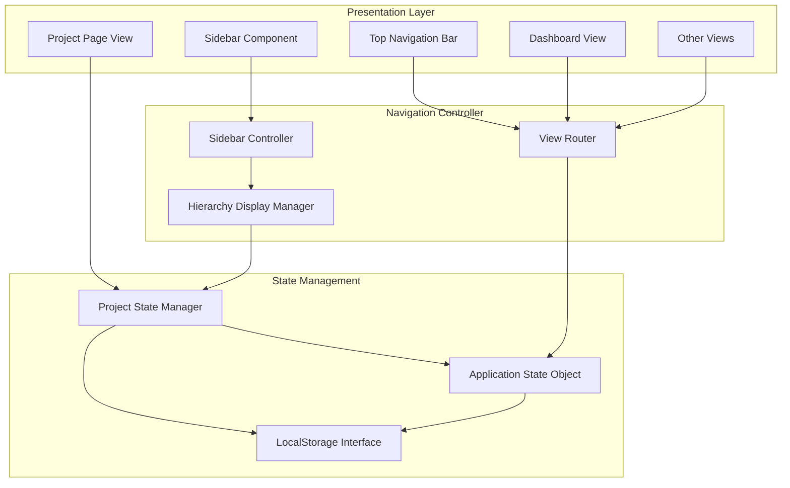
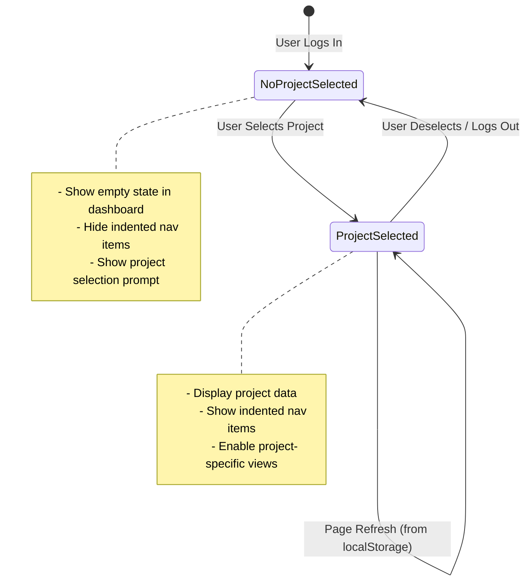

# Design Document

## Overview

This design implements a hierarchical navigation restructure for the QA Testing Dashboard application. The primary goal is to create a clearer visual hierarchy that establishes Projects as parent entities with child navigation items (Requirements, Scenarios, Test Cases, etc.) appearing as indented subordinates in the sidebar.

### Current State

The existing navigation structure treats all navigation items as peers, with a project selector dropdown in the top navigation bar. This creates confusion about the relationship between projects and their associated views (requirements, test cases, etc.).

**Current Architecture:**
- Top navigation bar contains project selector dropdown
- Sidebar contains flat list of navigation items
- All navigation items appear at same visual level
- Project selection state managed in localStorage and application state

### Proposed Changes

The new design moves project selection to a dedicated page and introduces visual hierarchy through indentation:

**New Architecture:**
- Top navigation bar simplified (user controls only, no project selector)
- Sidebar gains "Project" navigation item below "QA Dashboard"
- Project-specific navigation items (Requirements, Scenarios, etc.) appear indented when project selected
- Global navigation items (QA Dashboard, Knowledge Base, LangSmith, Settings) remain at standard indentation
- Dedicated Project page for project selection and management
- Empty state guidance when no project selected

### Key Benefits

1. **Clearer Mental Model**: Visual hierarchy makes parent-child relationships obvious
2. **Better Information Architecture**: Global vs. project-specific functionality is distinguished
3. **Improved Onboarding**: New users understand project structure immediately
4. **Consistent with UX Best Practices**: Hierarchical navigation is a standard pattern in enterprise applications


## Architecture

### High-Level Architecture

The system follows a client-side JavaScript architecture with vanilla JS and HTML/CSS. The navigation restructure affects three primary architectural layers:

1. **Presentation Layer** (HTML/CSS): UI components for sidebar, navigation items, and project page
2. **State Management Layer** (JavaScript): Application state, localStorage persistence, project selection logic
3. **Navigation Controller Layer** (JavaScript): View routing, navigation item visibility, hierarchy display logic



### Navigation Hierarchy Structure

The new navigation structure introduces two distinct levels:

**Level 0: Global Navigation Items** (no indentation)
- QA Dashboard
- **Project** (new)
- Knowledge Base (RAG)
- LangSmith
- Settings

**Level 1: Project-Specific Navigation Items** (indented, only visible when project selected)
- Requirements
- Scenarios
- Test Cases
- Test Automation
- Execution Workspace
- Reports

### State Management Architecture

The application maintains project selection state through a hybrid approach:

1. **In-Memory State**: `app.currentProject` object holds active project data
2. **Persistent State**: `localStorage.active_project_id` preserves selection across sessions
3. **Session State**: Page refresh restores from localStorage and fetches fresh project data

**State Transitions:**



## Components and Interfaces

### 1. Sidebar Component Modifications

**Component: `sidebar-container`**

The sidebar component is enhanced to support hierarchical navigation display.

**Interface Changes:**

```javascript
// Sidebar structure with hierarchy
interface SidebarNavigation {
  globalItems: NavigationItem[];        // Level 0 items
  projectItems: NavigationItem[];       // Level 1 items (conditionally displayed)
  selectedProject: string | null;       // Currently selected project ID
}

interface NavigationItem {
  id: string;                           // e.g., "dashboard", "requirements"
  label: string;                        // Display text
  icon: SVGElement;                     // Icon markup
  view: string;                         // Target view identifier
  level: 0 | 1;                         // Hierarchy level (0=global, 1=project-specific)
  visible: boolean;                     // Visibility state
  cssClass: string;                     // Additional styling classes
}
```

**Key Methods:**

```javascript
// Show/hide project-specific navigation items
function updateSidebarHierarchy(projectSelected: boolean): void

// Apply indentation styling to level 1 items
function applyHierarchyStyles(): void

// Update active navigation item highlight
function setActiveNavItem(viewId: string): void
```


### 2. Top Navigation Bar Component

**Component: `top-nav` (id: `project-select-wrapper`)**

The top navigation bar is simplified to remove project selection controls.

**Interface Changes:**

```javascript
// Simplified top navigation
interface TopNavigation {
  userControls: UserControlsWidget;     // User profile, logout
  actionButtons: ActionButton[];        // Quick action buttons (if any)
  // REMOVED: projectSelector, releaseSelector, cycleSelector
}

interface UserControlsWidget {
  userName: string;
  userAvatar: string;
  logoutAction: () => void;
}
```

**Removed Elements:**
- `project-select` dropdown
- `project-select-search` input field
- `release-select` dropdown
- `cycle-select` dropdown
- Project selector container styling

**Retained Elements:**
- User profile widget
- Logout functionality
- Any global action buttons

### 3. Project Page Component (New)

**Component: `project-page-view`**

A new full-page view for project selection and management.

**Interface:**

```javascript
interface ProjectPage {
  projects: Project[];                  // All available projects
  selectedProjectId: string | null;     // Currently selected project
  searchQuery: string;                  // Search filter text
  
  renderProjectGrid(): void;            // Render project cards in grid
  filterProjects(query: string): void;  // Filter by search
  selectProject(projectId: string): void; // Handle project selection
  createNewProject(): void;             // Navigate to project creation
}

interface Project {
  id: string;
  name: string;
  description: string;
  lineOfBusiness: string;
  lastAccessed: Date;
  isSelected: boolean;                  // Visual indicator
}
```


**Project Card Component:**

```javascript
interface ProjectCard {
  project: Project;
  isSelected: boolean;
  onClick: () => void;
  
  render(): HTMLElement;                // Returns card DOM element
}
```

**HTML Structure:**

```html
<div class="view-panel" id="project-page-view">
  <div class="page-header">
    <h1>Projects</h1>
    <input type="text" id="project-search" placeholder="Search projects..." />
  </div>
  
  <div class="project-grid">
    <!-- "Create New Project" card (always first) -->
    <div class="project-card project-card-new">
      <div class="card-icon">+</div>
      <h3>Create New Project</h3>
    </div>
    
    <!-- Existing project cards -->
    <div class="project-card" data-project-id="proj-123">
      <h3>Project Name</h3>
      <p class="project-description">Description text...</p>
      <div class="project-meta">
        <span class="lob-tag">Finance</span>
        <span class="last-accessed">Last accessed: 2 days ago</span>
      </div>
    </div>
    <!-- More cards... -->
  </div>
</div>
```

### 4. Empty State Component (New)

**Component: `dashboard-empty-state`**

Displays when no project is selected.

**Interface:**

```javascript
interface EmptyState {
  message: string;
  actionLabel: string;
  actionHandler: () => void;
  
  render(): HTMLElement;
  show(): void;
  hide(): void;
}
```


**HTML Structure:**

```html
<div class="empty-state" id="dashboard-empty-state">
  <svg class="empty-state-icon" viewBox="0 0 24 24">
    <!-- Icon markup -->
  </svg>
  <h2>No project selected</h2>
  <p>Please select a project to view dashboard metrics.</p>
  <button class="btn-primary" onclick="navigateToProjectPage()">
    Go to Projects
  </button>
</div>
```

### 5. Navigation Controller

**Module: `NavigationController`**

Manages view routing and sidebar state.

**Interface:**

```javascript
class NavigationController {
  constructor(app: Application);
  
  // Navigate to a view
  navigateTo(viewId: string): void;
  
  // Update sidebar based on project state
  updateSidebarForProjectState(hasProject: boolean): void;
  
  // Show/hide indented navigation items
  toggleProjectNavItems(visible: boolean): void;
  
  // Handle navigation item clicks
  handleNavItemClick(event: Event): void;
}
```

**Key Responsibilities:**
1. View switching (show active panel, hide others)
2. Sidebar active state management
3. Navigation item visibility based on project selection
4. URL hash management for deep linking (if applicable)


### 6. Project State Manager

**Module: `ProjectStateManager`**

Manages project selection state and persistence.

**Interface:**

```javascript
class ProjectStateManager {
  constructor(app: Application);
  
  // Get currently selected project
  getCurrentProject(): Project | null;
  
  // Set selected project (updates memory + localStorage)
  setCurrentProject(projectId: string): Promise<void>;
  
  // Clear project selection
  clearProjectSelection(): void;
  
  // Restore project from localStorage on page load
  restoreProjectFromStorage(): Promise<void>;
  
  // Subscribe to project change events
  onProjectChange(callback: (project: Project | null) => void): void;
}
```

**LocalStorage Keys:**
- `active_project_id`: Stores selected project ID

**Event System:**

```javascript
// Custom events for project state changes
const PROJECT_SELECTED = 'project:selected';
const PROJECT_CLEARED = 'project:cleared';

// Usage
document.addEventListener(PROJECT_SELECTED, (e) => {
  const project = e.detail.project;
  // Update UI accordingly
});
```

## Data Models

### Project Model

```javascript
interface Project {
  id: string;                           // Unique identifier
  name: string;                         // Display name
  description: string;                  // Project description
  lineOfBusiness: string;               // Business domain
  createdAt: Date;                      // Creation timestamp
  lastAccessed: Date;                   // Last access timestamp
  targetCredentials: Credentials;       // Associated test environment
  isActive: boolean;                    // Active/archived status
}
```


### Navigation Item Model

```javascript
interface NavigationItem {
  id: string;                           // e.g., "dashboard", "requirements"
  label: string;                        // Display text
  icon: string;                         // SVG path or icon identifier
  view: string;                         // Target view panel ID
  level: NavigationLevel;               // Hierarchy level
  visible: boolean;                     // Current visibility
  enabled: boolean;                     // Interactive state
  badge?: string | number;              // Optional badge (e.g., count)
}

enum NavigationLevel {
  GLOBAL = 0,                           // Not indented (QA Dashboard, Project, etc.)
  PROJECT_SPECIFIC = 1                  // Indented (Requirements, Scenarios, etc.)
}
```

### Application State Model

```javascript
interface ApplicationState {
  currentProject: Project | null;       // Active project
  currentView: string;                  // Active view ID
  user: User;                           // Logged-in user
  projects: Project[];                  // All available projects
  navigationItems: NavigationItem[];    // All navigation items
  sidebarExpanded: boolean;             // Sidebar state
}
```

### Empty State Model

```javascript
interface EmptyStateConfig {
  view: string;                         // Which view shows empty state
  icon: string;                         // Icon identifier
  title: string;                        // Main heading
  message: string;                      // Descriptive text
  actionLabel: string;                  // Button text
  actionHandler: string;                // Function name to call
}
```

## Error Handling

### Project Selection Errors

**Scenario 1: Project Not Found**
- **Trigger**: User has `active_project_id` in localStorage but project no longer exists
- **Handling**: 
  - Clear localStorage
  - Show empty state
  - Log warning to console
  - Display non-intrusive notification: "Previously selected project not found"

**Scenario 2: Project Load Failure**
- **Trigger**: API call to fetch project details fails
- **Handling**:
  - Retry once with exponential backoff
  - If retry fails, clear project selection
  - Show error notification with retry button
  - Log error details for debugging


**Scenario 3: Navigation to Project-Specific View Without Selected Project**
- **Trigger**: User directly navigates to `/requirements` with no project selected
- **Handling**:
  - Intercept navigation
  - Show modal or toast: "Please select a project first"
  - Redirect to Project page
  - After project selection, redirect to originally requested view

**Scenario 4: LocalStorage Unavailable**
- **Trigger**: Browser in private mode or storage quota exceeded
- **Handling**:
  - Fall back to session-only state (in-memory)
  - Show warning banner: "Project selection will not persist across sessions"
  - Continue operation normally

### Navigation Errors

**Scenario 5: View Panel Not Found**
- **Trigger**: Navigation to non-existent view ID
- **Handling**:
  - Log error with view ID
  - Fall back to dashboard view
  - Show error notification

**Scenario 6: Sidebar Rendering Failure**
- **Trigger**: DOM manipulation error during sidebar update
- **Handling**:
  - Catch exception
  - Log full stack trace
  - Attempt graceful degradation (show basic navigation)
  - Display error notification with page refresh option

### UI State Consistency Errors

**Scenario 7: Sidebar and Content Out of Sync**
- **Trigger**: Project state changes but sidebar doesn't update
- **Handling**:
  - Implement state change validation
  - Trigger forced sidebar refresh
  - Log inconsistency warning
  - Use defensive programming to always derive UI from single source of truth (app.currentProject)

## Testing Strategy

This feature involves primarily UI rendering, state management, and user interaction flows. The testing strategy focuses on **unit tests**, **integration tests**, and **end-to-end tests** rather than property-based testing.

### Why Property-Based Testing Is Not Applicable

This feature is **not suitable for property-based testing** because:


1. **UI Rendering and Layout**: The primary focus is on visual hierarchy, CSS styling, and DOM manipulation, which are best tested with snapshot tests and visual regression testing
2. **State Transitions**: While there are state transitions, they involve specific UI configurations rather than universal properties across infinite inputs
3. **User Interactions**: Testing click handlers, navigation flows, and event listeners requires example-based tests with concrete scenarios
4. **Side Effects**: localStorage persistence, DOM updates, and navigation are side-effect operations without pure input/output behavior

### Recommended Testing Approach

#### 1. Unit Tests

**Test Target: Navigation Controller**
- Test `navigateTo()` correctly shows/hides view panels
- Test `updateSidebarForProjectState()` applies correct CSS classes
- Test `toggleProjectNavItems()` shows/hides level 1 items

**Test Target: Project State Manager**
- Test `setCurrentProject()` updates both memory and localStorage
- Test `clearProjectSelection()` removes localStorage key
- Test `restoreProjectFromStorage()` handles missing/invalid data
- Test event emission on project state changes

**Test Target: Empty State Component**
- Test `render()` generates correct HTML structure
- Test `show()` and `hide()` toggle visibility
- Test action button click triggers navigation

**Example Unit Test:**

```javascript
describe('ProjectStateManager', () => {
  it('should store project ID in localStorage when setting current project', () => {
    const manager = new ProjectStateManager(app);
    const projectId = 'proj-123';
    
    manager.setCurrentProject(projectId);
    
    expect(localStorage.getItem('active_project_id')).toBe(projectId);
    expect(manager.getCurrentProject().id).toBe(projectId);
  });
  
  it('should clear localStorage when clearing project selection', () => {
    const manager = new ProjectStateManager(app);
    manager.setCurrentProject('proj-123');
    
    manager.clearProjectSelection();
    
    expect(localStorage.getItem('active_project_id')).toBeNull();
    expect(manager.getCurrentProject()).toBeNull();
  });
});
```


#### 2. Integration Tests

**Test Target: Login Flow**
- Test user login redirects to QA Dashboard
- Test dashboard shows empty state when no project selected
- Test "Go to Projects" button navigates to Project page

**Test Target: Project Selection Flow**
- Test selecting project from Project page updates sidebar
- Test indented navigation items appear after selection
- Test project card shows "selected" visual indicator
- Test navigation to dashboard shows project-specific data

**Test Target: Navigation Hierarchy**
- Test global navigation items always visible
- Test project-specific items hidden without selection
- Test project-specific items visible with selection
- Test correct indentation and styling applied

**Test Target: State Persistence**
- Test page refresh restores selected project
- Test page refresh with invalid project ID clears state
- Test localStorage unavailable falls back gracefully

**Example Integration Test:**

```javascript
describe('Project Selection Flow', () => {
  beforeEach(() => {
    // Setup: clean localStorage, mock API, render UI
    localStorage.clear();
    mockProjectAPI([{ id: 'proj-1', name: 'Test Project' }]);
    renderApplication();
  });
  
  it('should show indented nav items after selecting project', async () => {
    // Navigate to Project page
    clickNavItem('project');
    expect(getActiveView()).toBe('project-page-view');
    
    // Select a project
    clickProjectCard('proj-1');
    await waitForNavigation();
    
    // Verify indented items visible
    expect(isNavItemVisible('requirements')).toBe(true);
    expect(hasIndentationClass('requirements')).toBe(true);
    expect(getActiveView()).toBe('dashboard-view');
  });
});
```

#### 3. End-to-End Tests

**Test Scenarios:**
1. Complete login-to-project-selection flow
2. Project selection persists across browser refresh
3. Navigation between all views with project selected
4. Deselect project and verify UI updates
5. Create new project from Project page
6. Search and filter projects on Project page


**Example E2E Test (using Playwright or Cypress):**

```javascript
test('User can select project and navigate to project-specific views', async ({ page }) => {
  // Login
  await page.goto('/');
  await login(page, 'user@example.com', 'password');
  
  // Should land on dashboard with empty state
  await expect(page.locator('#dashboard-empty-state')).toBeVisible();
  
  // Click "Go to Projects"
  await page.click('button:has-text("Go to Projects")');
  await expect(page.locator('#project-page-view')).toBeVisible();
  
  // Select a project
  await page.click('.project-card[data-project-id="proj-123"]');
  
  // Should navigate to dashboard with project data
  await expect(page.locator('#dashboard-view')).toBeVisible();
  await expect(page.locator('#dashboard-empty-state')).not.toBeVisible();
  
  // Verify indented nav items visible
  await expect(page.locator('.nav-item[data-view="requirements"]')).toHaveClass(/nav-item-indented/);
  await expect(page.locator('.nav-item[data-view="requirements"]')).toBeVisible();
  
  // Navigate to Requirements
  await page.click('.nav-item[data-view="requirements"]');
  await expect(page.locator('#requirements-view')).toBeVisible();
  
  // Refresh page - project should persist
  await page.reload();
  await expect(page.locator('.nav-item[data-view="requirements"]')).toBeVisible();
});
```

#### 4. Visual Regression Tests

Use visual regression testing tools (Percy, Chromatic, or screenshot comparison) to verify:
- Sidebar indentation rendering correctly
- Project page card layout (2-3 column grid)
- Empty state appearance
- Selected project highlight styling
- Hover states for navigation items

#### 5. Accessibility Tests

- Keyboard navigation through all nav items
- Screen reader announces hierarchy correctly
- Focus indicators visible on all interactive elements
- ARIA attributes for navigation structure
- Color contrast meets WCAG AA standards

### Test Coverage Goals

- **Unit Tests**: 80%+ coverage of state management logic
- **Integration Tests**: All user flows covered
- **E2E Tests**: Critical paths (login, project selection, navigation)
- **Visual Regression**: All new UI components
- **Accessibility**: WCAG AA compliance verified


## Implementation Details

### Phase 1: Top Navigation Bar Simplification

**Files to Modify:**
- `frontend/index.html` - Remove project selector HTML
- `frontend/css/styles.css` - Remove project selector styles
- `frontend/js/app.js` - Remove project selector initialization logic

**Changes:**

1. **Remove HTML elements:**
   - `#project-select` dropdown
   - `#project-select-search` input
   - Release and cycle selectors (if present)
   - Keep user controls and logout

2. **Update CSS:**
   - Simplify `.top-nav` layout
   - Remove `.project-dropdown` styles
   - Adjust spacing for remaining elements

3. **Remove JavaScript:**
   - Project selector initialization
   - Project selector change handlers
   - Search filter logic

### Phase 2: Sidebar Restructure

**Files to Modify:**
- `frontend/index.html` - Add "Project" nav item, restructure items
- `frontend/css/styles.css` - Add indentation styles
- `frontend/js/app.js` - Add hierarchy display logic

**Changes:**

1. **HTML restructure:**

```html
<!-- Global navigation items -->
<div class="nav-item" data-view="dashboard" data-level="0">
  <!-- Icon and label -->
  QA Testing Dashboard
</div>

<div class="nav-item" data-view="project" data-level="0">
  <!-- Icon and label -->
  Project
</div>

<!-- Project-specific navigation items (hidden by default) -->
<div class="nav-item nav-item-indented" data-view="requirements" data-level="1" style="display: none;">
  <!-- Icon and label -->
  Requirements
</div>
<!-- ... more indented items ... -->

<!-- More global items -->
<div class="nav-item" data-view="knowledgebase" data-level="0">
  <!-- Icon and label -->
  Knowledge Base (RAG)
</div>
```


2. **CSS for hierarchy:**

```css
/* Indented navigation items */
.nav-item-indented {
  margin-left: 20px;
  font-size: 0.9rem;
  opacity: 0.85;
  position: relative;
}

/* Connecting line indicator */
.nav-item-indented::before {
  content: '';
  position: absolute;
  left: -12px;
  top: 50%;
  width: 8px;
  height: 1px;
  background-color: var(--border-color);
}

/* Hover state (same as regular nav items) */
.nav-item-indented:hover {
  background-color: var(--nav-hover-bg);
  opacity: 1;
}

/* Active state */
.nav-item-indented.active {
  background-color: var(--nav-active-bg);
  opacity: 1;
}
```

3. **JavaScript for visibility control:**

```javascript
// In app.js
updateSidebarHierarchy(hasProject) {
  const indentedItems = document.querySelectorAll('.nav-item[data-level="1"]');
  indentedItems.forEach(item => {
    item.style.display = hasProject ? 'flex' : 'none';
  });
}

// Call when project state changes
async selectProject(projectId) {
  // ... existing logic ...
  this.currentProject = project;
  this.updateSidebarHierarchy(true);
  // ... rest of logic ...
}

clearProjectSelection() {
  this.currentProject = null;
  this.updateSidebarHierarchy(false);
  localStorage.removeItem('active_project_id');
}
```

### Phase 3: Project Page Implementation

**Files to Create/Modify:**
- `frontend/index.html` - Add project page view panel
- `frontend/css/styles.css` - Add project grid styles
- `frontend/js/app.js` - Add project page rendering logic

**Changes:**

1. **HTML structure:**

```html
<div class="view-panel" id="project-page-view" style="display: none;">
  <div class="page-header">
    <h1>Projects</h1>
    <input type="text" id="project-search" placeholder="Search projects..." 
           class="form-control" style="max-width: 300px;" />
  </div>
  
  <div id="project-grid-container" class="project-grid">
    <!-- Populated dynamically -->
  </div>
</div>
```


2. **CSS for project grid:**

```css
.project-grid {
  display: grid;
  grid-template-columns: repeat(auto-fill, minmax(320px, 1fr));
  gap: 20px;
  margin-top: 24px;
}

.project-card {
  background: var(--bg-secondary);
  border: 2px solid var(--border-color);
  border-radius: var(--border-radius-lg);
  padding: 24px;
  cursor: pointer;
  transition: all 0.2s ease;
}

.project-card:hover {
  border-color: var(--accent-primary);
  box-shadow: 0 4px 12px rgba(0, 0, 0, 0.1);
  transform: translateY(-2px);
}

.project-card.selected {
  border-color: var(--accent-primary);
  background: var(--accent-primary-light);
}

.project-card-new {
  display: flex;
  flex-direction: column;
  align-items: center;
  justify-content: center;
  min-height: 180px;
  border-style: dashed;
}

.project-card-new .card-icon {
  font-size: 48px;
  color: var(--accent-primary);
  margin-bottom: 12px;
}

.project-card h3 {
  font-size: 1.2rem;
  font-weight: 600;
  margin-bottom: 8px;
  color: var(--text-primary);
}

.project-description {
  font-size: 0.9rem;
  color: var(--text-secondary);
  margin-bottom: 16px;
  line-height: 1.5;
}

.project-meta {
  display: flex;
  justify-content: space-between;
  align-items: center;
  font-size: 0.85rem;
}

.lob-tag {
  background: var(--accent-teal);
  color: white;
  padding: 4px 10px;
  border-radius: 4px;
  font-weight: 500;
}

.last-accessed {
  color: var(--text-tertiary);
}
```


3. **JavaScript for project page:**

```javascript
// In app.js
async renderProjectPage() {
  const container = document.getElementById('project-grid-container');
  if (!container) return;
  
  // Fetch projects
  const projects = await this.fetchProjects();
  
  // Build HTML
  let html = `
    <div class="project-card project-card-new" onclick="app.createNewProject()">
      <div class="card-icon">+</div>
      <h3>Create New Project</h3>
    </div>
  `;
  
  projects.forEach(project => {
    const isSelected = this.currentProject && this.currentProject.id === project.id;
    const selectedClass = isSelected ? 'selected' : '';
    const lastAccessed = this.formatRelativeTime(project.lastAccessed);
    
    html += `
      <div class="project-card ${selectedClass}" 
           data-project-id="${project.id}"
           onclick="app.selectProjectFromCard('${project.id}')">
        <h3>${this.escapeHtml(project.name)}</h3>
        <p class="project-description">${this.escapeHtml(project.description)}</p>
        <div class="project-meta">
          <span class="lob-tag">${this.escapeHtml(project.lineOfBusiness)}</span>
          <span class="last-accessed">Last accessed: ${lastAccessed}</span>
        </div>
      </div>
    `;
  });
  
  container.innerHTML = html;
}

async selectProjectFromCard(projectId) {
  await this.selectProject(projectId);
  this.navigateTo('dashboard');
}

// Search functionality
setupProjectSearch() {
  const searchInput = document.getElementById('project-search');
  if (!searchInput) return;
  
  searchInput.addEventListener('input', (e) => {
    const query = e.target.value.toLowerCase();
    const cards = document.querySelectorAll('.project-card:not(.project-card-new)');
    
    cards.forEach(card => {
      const text = card.textContent.toLowerCase();
      card.style.display = text.includes(query) ? 'flex' : 'none';
    });
  });
}
```

### Phase 4: Empty State Implementation

**Changes:**

1. **HTML in dashboard view:**

```html
<div class="view-panel active" id="dashboard-view">
  <!-- Empty state (shown when no project selected) -->
  <div class="empty-state" id="dashboard-empty-state" style="display: none;">
    <svg class="empty-state-icon" viewBox="0 0 24 24" fill="none" stroke="currentColor">
      <path stroke-linecap="round" stroke-linejoin="round" stroke-width="2" 
            d="M9 12h6m-6 4h6m2 5H7a2 2 0 01-2-2V5a2 2 0 012-2h5.586a1 1 0 01.707.293l5.414 5.414a1 1 0 01.293.707V19a2 2 0 01-2 2z" />
    </svg>
    <h2>No project selected</h2>
    <p>Please select a project to view dashboard metrics.</p>
    <button class="btn-primary" onclick="app.navigateTo('project')">
      Go to Projects
    </button>
  </div>
  
  <!-- Regular dashboard content -->
  <div id="dashboard-content">
    <!-- ... existing dashboard HTML ... -->
  </div>
</div>
```
