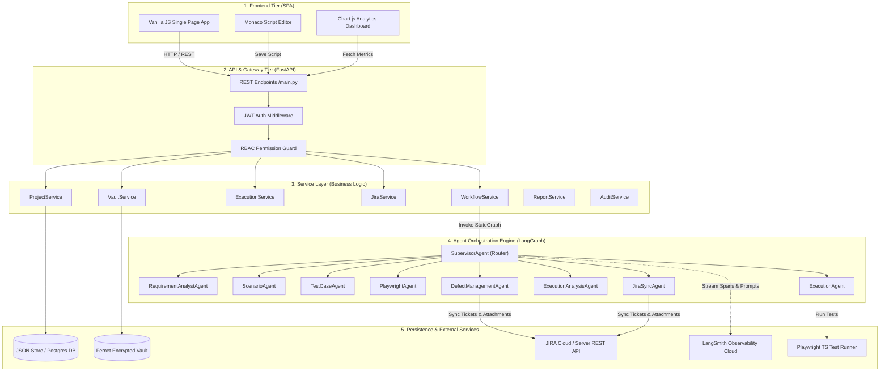
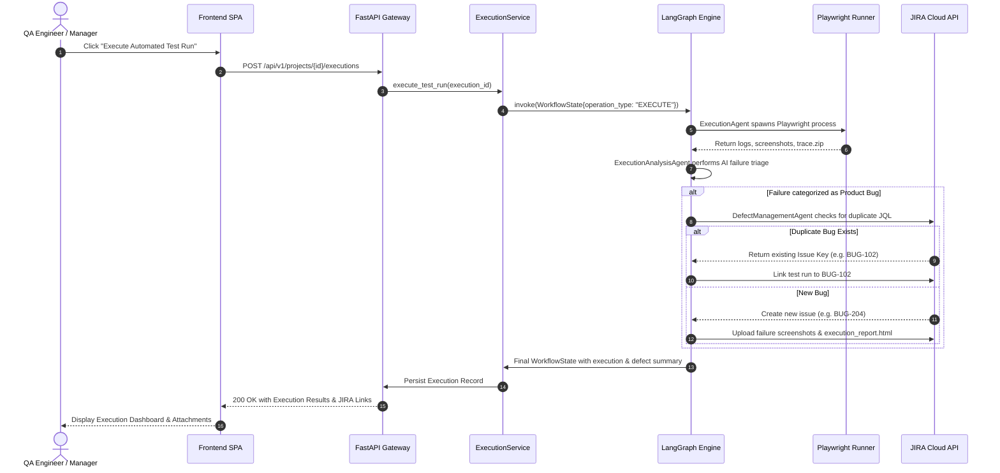

# System Architecture & Technical Specifications


An enterprise-grade, multi-agent AI test automation system powered by **FastAPI**, **LangGraph**, **LiteLLM**, and **Playwright**. The platform ingests Software Requirements Specifications (SRS), generates functional test scenarios, creates executable test cases, builds Playwright scripts, executes automated test runs, triages failures via root-cause AI, and synchronizes bugs directly to JIRA.

---

## Table of Contents

- [1. System Overview & Architecture Diagram](#1-system-overview--architecture-diagram)
- [2. System Layer Deep-Dive](#2-system-layer-deep-dive)
  - [2.1 Frontend Layer (SPA)](#21-frontend-layer-spa)
  - [2.2 REST API & Gateway Layer](#22-rest-api--gateway-layer)
  - [2.3 Domain Service Layer](#23-domain-service-layer)
  - [2.4 LangGraph Agent Engine](#24-langgraph-agent-engine)
  - [2.5 Data & Persistence Layer](#25-data--persistence-layer)
- [3. Multi-Agent Pipeline & Workflow State](#3-multi-agent-pipeline--workflow-state)
  - [3.1 Operations & Agent Routing Matrix](#31-operations--agent-routing-matrix)
  - [3.2 WorkflowState Schema](#32-workflowstate-schema)
  - [3.3 Detailed Agent Profiles](#33-detailed-agent-profiles)
- [4. Execution Sequence Diagram](#4-execution-sequence-diagram)
- [5. Configuration & Precedence Architecture](#5-configuration--precedence-architecture)
- [6. Security, RBAC & Encrypted Vault](#6-security-rbac--encrypted-vault)
  - [6.1 Role-Based Access Control (RBAC) Matrix](#61-role-based-access-control-rbac-matrix)
  - [6.2 Fernet Encrypted Vault](#62-fernet-encrypted-vault)
- [7. Observability & v1.3.0 Integrations](#7-observability--v130-integrations)
  - [7.1 LangSmith Tracing Integration](#71-langsmith-tracing-integration)
  - [7.2 JIRA Defect Lifecycle & HTML Report Attachments](#72-jira-defect-lifecycle--html-report-attachments)
- [8. Scalability & Resilience](#8-scalability--resilience)

---

## 1. System Overview & Architecture Diagram

The system employs a **5-tier decoupled architecture**, isolating presentation, API routing, domain business logic, autonomous agent orchestration, and persistent storage.



---

## 2. System Layer Deep-Dive

### 2.1 Frontend Layer (SPA)

The user interface is built as a zero-dependency, high-performance Single Page Application (SPA) delivered via FastAPI static files.

- **Technology Stack**: Native HTML5, CSS3 Variables, ES6 JavaScript.
- **Monaco Editor**: Integrated for live TypeScript Playwright code review and manual script modifications.
- **Chart.js Integration**: Renders real-time test coverage distribution, automation pass rates, execution trends, and defect severity pie charts.
- **API Client (`frontend/js/api.js`)**: Encapsulates `fetch()` with automatic `Authorization: Bearer <token>` header injection, automatic 401 handling, and response envelope parsing.
- **View Router (`frontend/js/app.js`)**: Dynamic view switching via hash-based routing (`#projects`, `#requirements`, `#scenarios`, `#testcases`, `#executions`, `#settings`).

### 2.2 REST API & Gateway Layer

Implemented in `backend/main.py` using FastAPI 0.116, providing over 30 RESTful endpoints.

- **Authentication**: JWT tokens generated via `python-jose` (HS256 encryption) with configurable expiration.
- **RBAC Guard (`has_permission`)**: Custom FastAPI dependency evaluating user claims against required entity actions (`CREATE`, `READ`, `UPDATE`, `DELETE`, `EXECUTE`).
- **Async Execution Handlers**: Long-running Playwright scripts run asynchronously in background tasks, exposing real-time execution logs.

### 2.3 Domain Service Layer

Decoupled Python services handle core business operations:

| Service Name | Responsibility |
|---|---|
| `ProjectService` | CRUD management for projects, SRS documents, test scenarios, and test cases. |
| `WorkflowService` | Instantiates and invokes the LangGraph `StateGraph` for AI operations. |
| `ExecutionService` | Controls Playwright test execution environment, log streaming, and artifact capture. |
| `JiraService` | Interfaces with Atlassian JIRA REST APIs for story import, defect creation, and attachment upload. |
| `VaultService` | AES-256 Fernet encrypted credential storage for target application logins. |
| `ReportService` | Generates HTML, PDF, and JUnit XML test execution reports. |
| `AuditService` | Logs user mutations with user identity, operation details, and timestamps. |
| `RecoveryManager` | Intercepts interrupted test runs and restores partial state. |
| `BatchQueueManager` | Queues and coordinates batch test execution requests. |

### 2.4 LangGraph Agent Engine

The core AI engine uses a **LangGraph StateGraph** to manage multi-agent collaboration:

- **State Immutability**: All agents receive a typed `WorkflowState` dictionary and return an updated state object.
- **Zero Direct Agent Calls**: Agents communicate strictly through state modifications.
- **Supervisor-Driven Routing**: The `SupervisorAgent` reads the operation type and current state to determine the next agent to execute.

### 2.5 Data & Persistence Layer

Flexible data storage architecture adhering to the Repository Pattern (`backend/repository/`):

- **Primary Repository (`project_repository.py`)**: Lightweight JSON file storage (`backend/database/project_store.json`) with atomic write operations.
- **PostgreSQL Repository (`postgres_project_repository.py`)**: Full SQLAlchemy ORM repository for enterprise production deployments with Alembic migrations.
- **Encrypted Vault (`vault.json`)**: Encrypted storage for target site usernames and passwords using `cryptography.fernet`.

---

## 3. Multi-Agent Pipeline & Workflow State

### 3.1 Operations & Agent Routing Matrix

The `SupervisorAgent` routes state through specific agent execution pipelines based on the operation requested:

| Operation Type | Execution Pipeline Flow | Primary Output |
|---|---|---|
| `INGEST` | `Supervisor` → `RequirementAnalystAgent` → `FeatureInventoryAgent` → `END` | Parsed requirement structure & feature map |
| `BACKLOG` | `Supervisor` → `BacklogCreationAgent` → `QAStoryAnalyzerAgent` → `ScenarioAgent` → `HumanApprovalAgent` → `END` | User stories & initial test scenarios |
| `GENERATE_SCENARIOS` | `Supervisor` → `ScenarioAgent` → `HumanApprovalAgent` → `END` | Functional test scenarios |
| `GENERATE_TESTCASES` | `Supervisor` → `TestCaseAgent` → `EvaluationAgent` → `HumanApprovalAgent` → `END` | Detailed step-by-step test cases |
| `GENERATE_PLAYWRIGHT` | `Supervisor` → `QAAutomationOrchestratorAgent` → `PlaywrightAgent` → `END` | TypeScript Playwright test scripts |
| `EXECUTE` | `Supervisor` → `ExecutionAgent` → `ExecutionAnalysisAgent` → `DefectManagementAgent` → `ReportAgent` → `END` | Execution logs, failure triage, JIRA defects, HTML report |

---

### 3.2 WorkflowState Schema

The typed dictionary structure passed across agent nodes:

```python
class WorkflowState(TypedDict, total=False):
    operation_type: str                  # INGEST | GENERATE_SCENARIOS | GENERATE_TESTCASES | EXECUTE | etc.
    project_id: str                      # Target project UUID
    requirement_id: Optional[str]        # Requirement document UUID
    requirement_text: Optional[str]      # Raw or parsed requirement content
    scenarios: List[Dict[str, Any]]      # Generated or existing test scenarios
    test_cases: List[Dict[str, Any]]     # Generated or existing test cases
    playwright_scripts: List[Dict]       # Generated Playwright TypeScript code snippets
    execution_results: List[Dict]        # Raw execution outputs (status, logs, duration)
    analysis_results: List[Dict]         # AI failure triage (Product Bug vs Flaky vs Environment)
    defects_created: List[Dict]          # Created or linked JIRA bug keys
    approved_by_human: bool              # Human approval gate status
    error_message: Optional[str]         # Pipeline error context
```

---

### 3.3 Detailed Agent Profiles

#### 1. SupervisorAgent
- **Role**: Traffic Controller & Graph Router.
- **Function**: Reads `operation_type` and evaluation flags in `WorkflowState` to determine which node to trigger next.

#### 2. RequirementAnalystAgent
- **Role**: SRS Parser & Context Extractor.
- **Function**: Accepts text/PDF/Word/Excel requirements, extracts functional constraints, acceptance criteria, and domain rules.

#### 3. ScenarioAgent
- **Role**: Functional Scenario Generator.
- **Function**: Uses LiteLLM to produce positive, negative, edge-case, and security test scenarios with preconditions.

#### 4. TestCaseAgent
- **Role**: Detailed Step Designer.
- **Function**: Expands scenarios into actionable test steps, input test data, and expected assertion checkpoints.

#### 5. EvaluationAgent
- **Role**: Quality & Deduplication Guard.
- **Function**: Performs Jaccard similarity scoring to remove duplicate test cases, assigns confidence scores, and verifies step clarity.

#### 6. PlaywrightAgent
- **Role**: Automation Code Generator.
- **Function**: Translates test steps into modular TypeScript Playwright scripts adhering to Page Object Model (POM) patterns and custom element locators.

#### 7. ExecutionAgent
- **Role**: Automated Test Runner.
- **Function**: Spawns isolated Node.js Playwright processes, streams stdout/stderr, captures screenshots, video recordings, and trace zip files.

#### 8. ExecutionAnalysisAgent
- **Role**: AI Failure Triager.
- **Function**: Analyzes failure logs and screenshots to categorize failures into **Product Bug**, **Environment Issue**, or **Flaky Test**, identifying probable root cause.

#### 9. DefectManagementAgent & JiraSyncAgent
- **Role**: JIRA Defect Lifecycle Manager.
- **Function**: Generates semantic JQL to search for existing open defects in JIRA. If duplicate is found, links the failure; otherwise, creates a new JIRA Bug ticket and automatically attaches screenshots and the HTML execution report.

---

## 4. Execution Sequence Diagram

The following sequence illustrates the end-to-end execution flow when a user requests test execution from the UI:



---

## 5. Configuration & Precedence Architecture

The system uses a 3-tier configuration hierarchy managed by `backend/config/settings.py`:

```
┌─────────────────────────────────────────────────────────────┐
│                 1. Environment Variables (.env)             │
│   Highest Precedence (LLM_API_KEY, LANGSMITH_API_KEY, DB)   │
└──────────────────────────────┬──────────────────────────────┘
                               │ Overrides
┌──────────────────────────────▼──────────────────────────────┐
│             2. Runtime Settings (override.yaml)            │
│   Medium Precedence (User UI modifications, threshold edits) │
└──────────────────────────────┬──────────────────────────────┘
                               │ Overrides
┌──────────────────────────────▼──────────────────────────────┐
│             3. Committed Defaults (default_config.yaml)    │
│   Base Precedence (Default models, retry limits, timeouts)  │
└─────────────────────────────────────────────────────────────┘
```

---

## 6. Security, RBAC & Encrypted Vault

### 6.1 Role-Based Access Control (RBAC) Matrix

The system enforces strict permission checks on all REST endpoints:

| Feature / Resource | Admin | Manager | Engineer | Viewer |
|---|:---:|:---:|:---:|:---:|
| View Projects & Reports | ✅ | ✅ | ✅ | ✅ |
| Upload SRS & Generate Scenarios | ✅ | ✅ | ✅ | ❌ |
| Create & Edit Test Cases | ✅ | ✅ | ✅ | ❌ |
| Edit Playwright Scripts | ✅ | ✅ | ✅ | ❌ |
| Trigger Test Executions | ✅ | ✅ | ✅ | ❌ |
| Approve / Reject Human Review Gates | ✅ | ✅ | ❌ | ❌ |
| Configure Vault Credentials | ✅ | ❌ | ❌ | ❌ |
| System Settings & User Management | ✅ | ❌ | ❌ | ❌ |

### 6.2 Fernet Encrypted Vault

Application credentials used by Playwright scripts for logging into target applications are protected using AES-256 Fernet symmetric encryption (`cryptography.fernet`).

```python
# Vault Credential Encryption Architecture
key = Fernet.generate_key()  # Stored in VAULT_SECRET_KEY environment variable
cipher = Fernet(key)

encrypted_password = cipher.encrypt(raw_password.encode()).decode()
# Decrypted only in-memory during script execution by VaultService
```

---

## 7. Observability & v1.3.0 Integrations

### 7.1 LangSmith Tracing Integration

Version 1.3.0 integrates **LangSmith** for full-stack LLM and agent execution observability.

- **Initialization**: `backend/graph/workflow.py` loads environment variables into `os.environ` prior to importing `@traceable`.
- **Node Spans**: Every agent node execution is wrapped with `@traceable(name="AgentName")`.
- **Captured Telemetry**: Prompts, completions, latency, token usage breakdown, agent decision routing, and error stack traces.

```
LangSmith Trace Tree Example:
└─ Complete_Workflow_Execution [Root]
   ├─ SupervisorAgent
   ├─ RequirementAnalystAgent
   ├─ ScenarioAgent
   │  └─ LiteLLM.completion (gpt-4o) [Prompt/Response/Tokens]
   ├─ TestCaseAgent
   └─ ExecutionAnalysisAgent
```

### 7.2 JIRA Defect Lifecycle & HTML Report Attachments

When test failures occur, the `JiraSyncAgent` (`backend/agents/jira_sync_agent.py`) executes the following workflow:

1. **Failure Verification**: Confirms test run status is `FAILED` and triage result is `Product Bug`.
2. **Duplicate Search**: Executes AI-generated semantic JQL query against JIRA REST API.
3. **Bug Creation**: Creates JIRA Bug with steps to reproduce, expected vs actual behavior, and environment details.
4. **HTML Report Attachment**: Locates the generated HTML execution report at `backend/playwrightt/public/artifacts/{execution_id}/report.html` and uploads it directly to the JIRA ticket via `JiraService.upload_attachment()`.

---

## 8. Scalability & Resilience

- **Stateless Agent Execution**: Agent nodes hold no local process state; all transient context lives within the `WorkflowState` object.
- **Database Abstraction**: Smooth transition from default lightweight single-file JSON database (`project_store.json`) to enterprise PostgreSQL without application code changes.
- **Failure Recovery**: `RecoveryManager` captures interrupted batch executions and allows resumption from the last verified agent node.
- **Isolated Playwright Processes**: Test execution runs in segregated Node.js processes, preventing memory leaks from impacting the FastAPI server.
